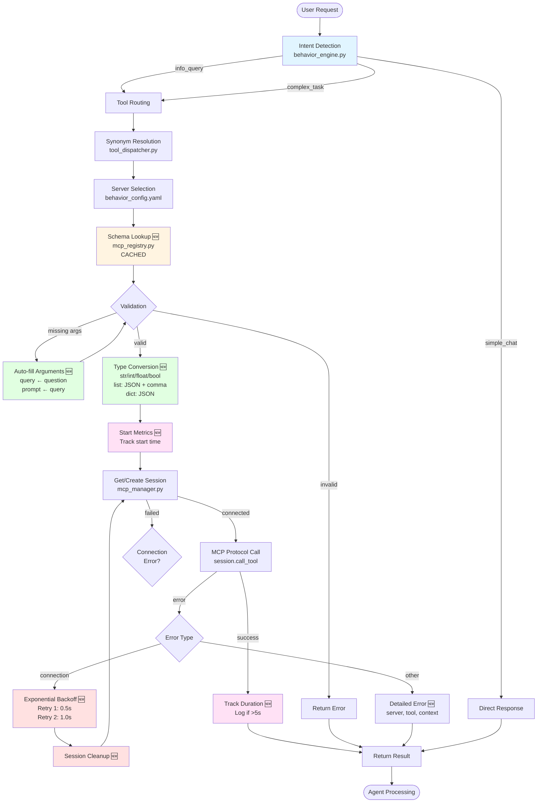
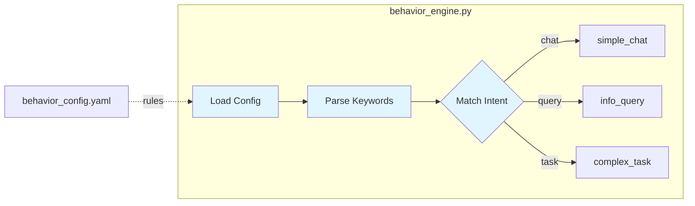
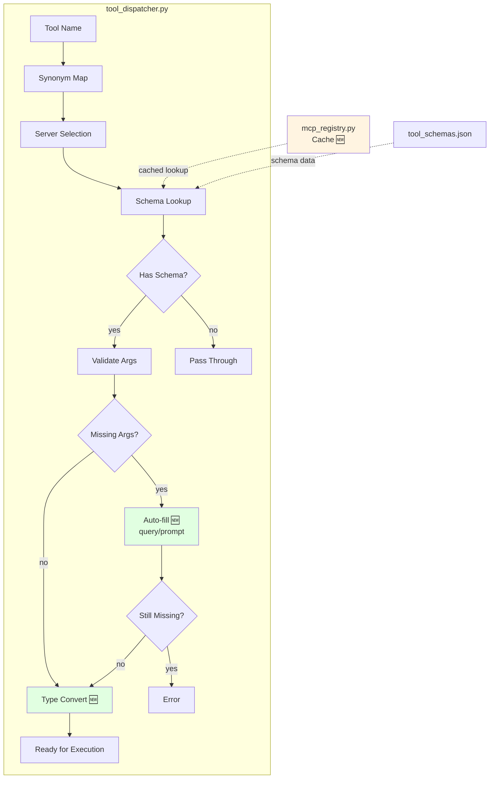
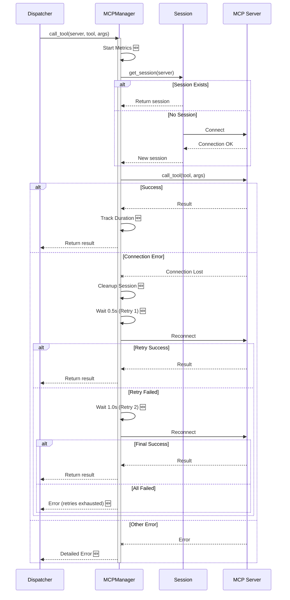
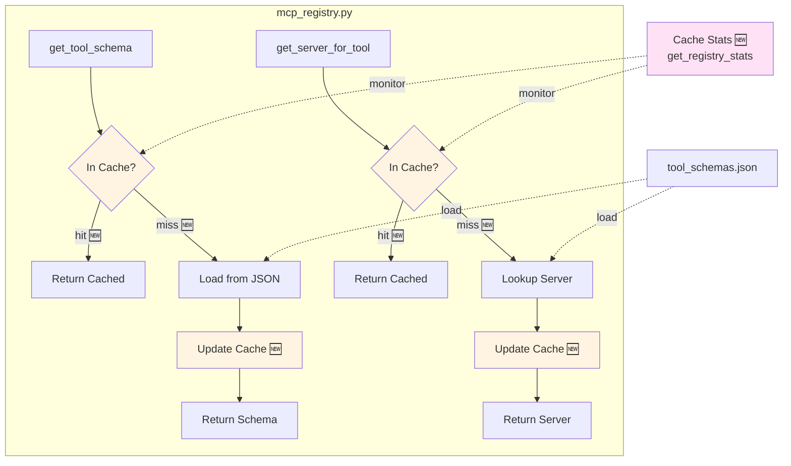
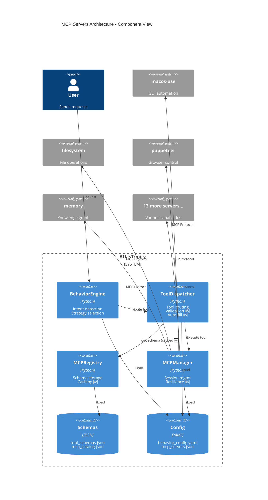
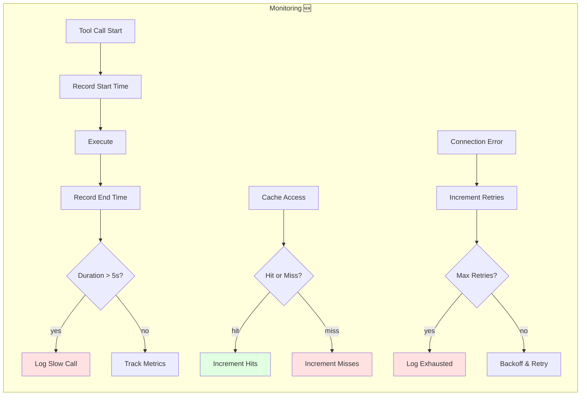
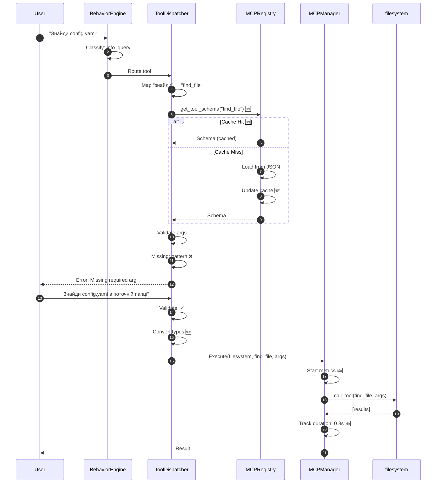

<!-- AUTO-UPDATED: 2026-02-17T23:26:09.101388 -->
<!-- Modified: .agent/docs/mcp_architecture_diagram.md, .githuworkflows/ci-core.yml, docs/vibe-usage.md -->


<!-- AUTO-UPDATED: 2026-02-17T23:20:02.144436 -->
<!-- Modified: .agent/docs/mcp_architecture_diagram.md, src/brain/data/architecture_diagrams/mcp_architecture.md, src/renderer/components/NeuralCore.tsx -->


<!-- AUTO-UPDATED: 2026-02-17T23:03:25.716210 -->
<!-- Modified: .agent/docs/mcp_architecture_diagram.md, docs/reports/MCP_SYSTEM_ANALYSIS.md, docs/reports/PROVIDERS_IMPROVEMENT_PLAN.md -->


<!-- AUTO-UPDATED: 2026-02-17T23:00:42.783745 -->
<!-- Modified: .agent/docs/mcp_architecture_diagram.md, knip.json, scripts/windsurf/manual_tests/manual_test.py -->


<!-- AUTO-UPDATED: 2026-02-17T22:33:39.894120 -->
<!-- Modified: .agent/docs/mcp_architecture_diagram.md, knip.json, scripts/windsurf/test_all_models.cjs -->


<!-- AUTO-UPDATED: 2026-02-17T22:10:56.368122 -->
<!-- Modified: .agent/docs/mcp_architecture_diagram.md, scripts/windsurf/test_all_models.cjs, src/brain/data/architecture_diagrams/mcp_architecture.md -->


<!-- AUTO-UPDATED: 2026-02-17T06:15:20.812951 -->
<!-- Modified: .agent/docs/mcp_architecture_diagram.md, src/brain/data/architecture_diagrams/mcp_architecture.md, src/maintenance/windsurf_diagnostic.py -->


<!-- AUTO-UPDATED: 2026-02-17T06:08:42.706613 -->
<!-- Modified: .agent/docs/mcp_architecture_diagram.md, .secrets.baseline, manual_test.py -->


<!-- AUTO-UPDATED: 2026-02-17T05:36:29.312524 -->
<!-- Modified: .agent/docs/mcp_architecture_diagram.md, config/behavior_config.yaml.template, config/mcp_servers.json.template -->


<!-- AUTO-UPDATED: 2026-02-17T02:22:20.819276 -->
<!-- Modified: .secrets.baseline, backups/databases/atlastrinity.db.encrypted, backups/databases/backup_metadata.json -->


<!-- AUTO-UPDATED: 2026-02-17T01:50:21.936105 -->
<!-- Modified: .agent/docs/mcp_architecture_diagram.md, scripts/windsurf/analyze_cascade_traffic.py, scripts/windsurf/test_cascade_action.py -->


<!-- AUTO-UPDATED: 2026-02-17T01:46:45.716217 -->
<!-- Modified: scripts/windsurf/test_cascade.cjs, scripts/windsurf/test_chat_code_gen.cjs, vendor/mcp-server-windsurf/Sources/Constants.swift -->


<!-- AUTO-UPDATED: 2026-02-16T19:06:31.230595 -->
<!-- Modified: scripts/windsurf/test_cascade_action_phase.py, src/testing/live_fallback_test.py, vendor/mcp-server-windsurf/Sources/CascadeStreamer.swift -->


<!-- AUTO-UPDATED: 2026-02-16T16:29:29.530931 -->
<!-- Modified: .agent/docs/mcp_architecture_diagram.md, src/brain/core/orchestration/orchestrator.py, src/brain/core/server/server.py -->


<!-- AUTO-UPDATED: 2026-02-16T16:17:01.011045 -->
<!-- Modified: .agent/docs/mcp_architecture_diagram.md, .secrets.baseline, src/brain/data/architecture_diagrams/mcp_architecture.md -->


<!-- AUTO-UPDATED: 2026-02-16T15:58:28.372043 -->
<!-- Modified: .agent/docs/mcp_architecture_diagram.md, src/brain/data/architecture_diagrams/mcp_architecture.md, src/renderer/App.tsx -->


<!-- AUTO-UPDATED: 2026-02-16T15:44:17.740261 -->
<!-- Modified: .agent/docs/mcp_architecture_diagram.md, .gitignore, src/brain/data/architecture_diagrams/mcp_architecture.md -->


<!-- AUTO-UPDATED: 2026-02-16T15:17:09.584310 -->
<!-- Modified: .agent/docs/mcp_architecture_diagram.md, .vscode/launch.json, package.json -->


<!-- AUTO-UPDATED: 2026-02-16T15:11:38.427342 -->
<!-- Modified: .agent/docs/mcp_architecture_diagram.md, requirements.txt, src/brain/data/architecture_diagrams/mcp_architecture.md -->


<!-- AUTO-UPDATED: 2026-02-16T15:11:06.467894 -->
<!-- Modified: .agent/docs/mcp_architecture_diagram.md, src/brain/data/architecture_diagrams/mcp_architecture.md, vendor/mcp-server-windsurf/Sources/CascadeStreamer.swift -->


<!-- AUTO-UPDATED: 2026-02-16T11:37:45.643947 -->
<!-- Modified: .agent/docs/mcp_architecture_diagram.md, scripts/verify_native_deployment.py, scripts/windsurf/analyze_pb.py -->


<!-- AUTO-UPDATED: 2026-02-16T11:33:41.481102 -->
<!-- Modified: .agent/docs/mcp_architecture_diagram.md, src/brain/data/architecture_diagrams/mcp_architecture.md, vendor/XcodeBuildMCP/src/integrations/macos-tools-bridge/backend.ts -->


<!-- AUTO-UPDATED: 2026-02-16T11:33:30.705750 -->
<!-- Modified: .agent/docs/mcp_architecture_diagram.md, src/brain/data/architecture_diagrams/mcp_architecture.md, vendor/mcp-server-windsurf/Package.swift -->


<!-- AUTO-UPDATED: 2026-02-16T11:33:03.614298 -->
<!-- Modified: .agent/docs/mcp_architecture_diagram.md, .secrets.baseline, scripts/verify_native_deployment.py -->


<!-- AUTO-UPDATED: 2026-02-16T09:26:58.666444 -->
<!-- Modified: .agent/docs/mcp_architecture_diagram.md, WINDSURF_FINAL_SUMMARY.md, WINDSURF_MCP_INTEGRATION_SUCCESS.md -->


<!-- AUTO-UPDATED: 2026-02-16T09:25:47.430919 -->
<!-- Modified: .agent/docs/mcp_architecture_diagram.md, WINDSURF_DEPLOYMENT_GUIDE.md, WINDSURF_MCP_COMPLETE_SUMMARY.md -->


<!-- AUTO-UPDATED: 2026-02-16T08:54:32.569492 -->
<!-- Modified: .agent/docs/mcp_architecture_diagram.md, scripts/windsurf/comprehensive_demo.py, scripts/windsurf/demo_action_phase.py -->


<!-- AUTO-UPDATED: 2026-02-16T08:45:02.698109 -->
<!-- Modified: .agent/docs/mcp_architecture_diagram.md, scripts/windsurf/comprehensive_demo.py, src/brain/data/architecture_diagrams/mcp_architecture.md -->


<!-- AUTO-UPDATED: 2026-02-16T08:39:25.315874 -->
<!-- Modified: .agent/docs/mcp_architecture_diagram.md, src/brain/data/architecture_diagrams/mcp_architecture.md, vendor/mcp-server-windsurf/Package.swift -->


<!-- AUTO-UPDATED: 2026-02-16T08:38:11.044679 -->
<!-- Modified: .agent/docs/mcp_architecture_diagram.md, scripts/windsurf/demo_action_phase.py, scripts/windsurf/test_cascade_action_phase.py -->


<!-- AUTO-UPDATED: 2026-02-16T08:33:20.753143 -->
<!-- Modified: .agent/docs/mcp_architecture_diagram.md, scripts/windsurf/analyze_pb.py, src/brain/data/architecture_diagrams/mcp_architecture.md -->


<!-- AUTO-UPDATED: 2026-02-16T08:29:20.875813 -->
<!-- Modified: .agent/docs/mcp_architecture_diagram.md, WINDSURF_MCP_REPORT.md, scripts/windsurf/analyze_pb.py -->


<!-- AUTO-UPDATED: 2026-02-16T08:28:43.970328 -->
<!-- Modified: .agent/docs/mcp_architecture_diagram.md, scripts/windsurf/test_cascade.py, src/brain/data/architecture_diagrams/mcp_architecture.md -->


<!-- AUTO-UPDATED: 2026-02-16T07:08:26.360624 -->
<!-- Modified: .agent/docs/mcp_architecture_diagram.md, .secrets.baseline, scripts/windsurf/test_cascade.py -->


<!-- AUTO-UPDATED: 2026-02-16T07:04:43.856965 -->
<!-- Modified: .agent/docs/mcp_architecture_diagram.md, scripts/windsurf/test_all_models.py, scripts/windsurf/test_cascade.py -->


<!-- AUTO-UPDATED: 2026-02-16T06:47:28.415811 -->
<!-- Modified: .agent/docs/mcp_architecture_diagram.md, .secrets.baseline, scripts/windsurf/test_all_models.py -->


<!-- AUTO-UPDATED: 2026-02-16T06:41:37.489485 -->
<!-- Modified: .agent/docs/mcp_architecture_diagram.md, scripts/windsurf/demo_atlas_windsurf.py, scripts/windsurf/test_all_models.py -->


<!-- AUTO-UPDATED: 2026-02-16T06:05:23.900988 -->
<!-- Modified: .agent/docs/mcp_architecture_diagram.md, WINDSURF_MCP_REPORT.md, src/brain/data/architecture_diagrams/mcp_architecture.md -->


<!-- AUTO-UPDATED: 2026-02-16T05:48:50.692826 -->
<!-- Modified: .agent/docs/mcp_architecture_diagram.md, WINDSURF_MCP_REPORT.md, src/brain/data/architecture_diagrams/mcp_architecture.md -->


<!-- AUTO-UPDATED: 2026-02-16T05:47:54.222639 -->
<!-- Modified: .agent/docs/mcp_architecture_diagram.md, .githuworkflows/auto-commit-secrets.yml, src/brain/data/architecture_diagrams/mcp_architecture.md -->


<!-- AUTO-UPDATED: 2026-02-16T05:47:45.359526 -->
<!-- Modified: .agent/docs/mcp_architecture_diagram.md, .githuworkflows/auto-commit-secrets.yml, src/brain/data/architecture_diagrams/mcp_architecture.md -->


<!-- AUTO-UPDATED: 2026-02-16T04:01:32.282384 -->
<!-- Modified: .agent/docs/mcp_architecture_diagram.md, .secrets.baseline, src/brain/data/architecture_diagrams/mcp_architecture.md -->


<!-- AUTO-UPDATED: 2026-02-16T04:01:15.515201 -->
<!-- Modified: .agent/docs/mcp_architecture_diagram.md, WINDSURF_MCP_REPORT.md, src/brain/data/architecture_diagrams/mcp_architecture.md -->


<!-- AUTO-UPDATED: 2026-02-16T03:50:18.361532 -->
<!-- Modified: .agent/docs/mcp_architecture_diagram.md, .githuworkflows/auto-commit-secrets.yml, lefthook.yml -->


<!-- AUTO-UPDATED: 2026-02-16T03:21:36.015238 -->
<!-- Modified: .secrets.baseline -->


<!-- AUTO-UPDATED: 2026-02-16T03:11:05.518225 -->
<!-- Modified: .agent/docs/mcp_architecture_diagram.md, src/brain/data/architecture_diagrams/mcp_architecture.md, src/maintenance/windsurf_diagnostic.py -->


<!-- AUTO-UPDATED: 2026-02-16T03:03:26.489527 -->
<!-- Modified: .agent/docs/mcp_architecture_diagram.md, .secrets.baseline, src/brain/data/architecture_diagrams/mcp_architecture.md -->


<!-- AUTO-UPDATED: 2026-02-16T02:48:15.658168 -->
<!-- Modified: .agent/docs/mcp_architecture_diagram.md, .vscode/launch.json, package.json -->


<!-- AUTO-UPDATED: 2026-02-16T02:45:53.291581 -->
<!-- Modified: .agent/docs/mcp_architecture_diagram.md, .secrets.baseline, src/brain/data/architecture_diagrams/mcp_architecture.md -->


<!-- AUTO-UPDATED: 2026-02-16T02:40:05.406199 -->
<!-- Modified: .agent/docs/mcp_architecture_diagram.md, PROVIDERS_IMPROVEMENT_PLAN.md, config/all_models.json -->


<!-- AUTO-UPDATED: 2026-02-16T02:37:08.335804 -->
<!-- Modified: .agent/docs/mcp_architecture_diagram.md, .agent/workflows/github-operations.md, .agent/workflows/self_healing.md -->


<!-- AUTO-UPDATED: 2026-02-16T01:18:23.126320 -->
<!-- Modified: .agent/docs/mcp_architecture_diagram.md, src/brain/core/orchestration/orchestrator.py, src/brain/data/architecture_diagrams/mcp_architecture.md -->


<!-- AUTO-UPDATED: 2026-02-16T01:16:24.680727 -->
<!-- Modified: .agent/docs/mcp_architecture_diagram.md, config/vibe/agents/accept-edits.toml.template, config/vibe/agents/auto-approve.toml.template -->


<!-- AUTO-UPDATED: 2026-02-16T01:16:14.461443 -->
<!-- Modified: .agent/docs/mcp_architecture_diagram.md, src/brain/data/architecture_diagrams/mcp_architecture.md, src/mcp_server/devtools_server.py -->


<!-- AUTO-UPDATED: 2026-02-16T01:16:04.105263 -->
<!-- Modified: .agent/docs/mcp_architecture_diagram.md, src/brain/data/architecture_diagrams/mcp_architecture.md, src/mcp_server/golden_fund/lientity_extractor.py -->


<!-- AUTO-UPDATED: 2026-02-16T00:01:11.297682 -->
<!-- Modified: .agent/docs/mcp_architecture_diagram.md, .githuworkflows/total-integrity.yml, src/brain/data/architecture_diagrams/mcp_architecture.md -->


<!-- AUTO-UPDATED: 2026-02-15T23:55:38.652143 -->
<!-- Modified: .agent/docs/mcp_architecture_diagram.md, src/brain/data/architecture_diagrams/mcp_architecture.md, src/mcp_server/golden_fund/lientity_extractor.py -->


<!-- AUTO-UPDATED: 2026-02-15T23:55:26.525871 -->
<!-- Modified: .agent/docs/mcp_architecture_diagram.md, src/brain/data/architecture_diagrams/mcp_architecture.md, src/mcp_server/golden_fund/liformats.py -->


<!-- AUTO-UPDATED: 2026-02-15T23:55:13.954887 -->
<!-- Modified: .agent/docs/mcp_architecture_diagram.md, src/brain/core/orchestration/orchestrator.py, src/brain/data/architecture_diagrams/mcp_architecture.md -->


<!-- AUTO-UPDATED: 2026-02-15T23:54:55.501986 -->
<!-- Modified: .agent/docs/mcp_architecture_diagram.md, .secrets.baseline, config/vibe_config.toml.template -->


<!-- AUTO-UPDATED: 2026-02-15T23:37:22.867018 -->
<!-- Modified: backups/databases/atlastrinity.db.encrypted, backups/databases/backup_metadata.json, backups/databases/golden_fund.db.encrypted -->


<!-- AUTO-UPDATED: 2026-02-15T18:04:46.414322 -->
<!-- Modified: backups/databases/atlastrinity.db.encrypted, backups/databases/backup_metadata.json, backups/databases/golden_fund.db.encrypted -->


<!-- AUTO-UPDATED: 2026-02-15T17:59:35.913550 -->
<!-- Modified: .agent/docs/mcp_architecture_diagram.md, src/brain/data/architecture_diagrams/mcp_architecture.md, vendor/XcodeBuildMCP/src/integrations/macos-tools-bridge/index.ts -->


<!-- AUTO-UPDATED: 2026-02-15T17:43:21.873009 -->
<!-- Modified: backups/databases/atlastrinity.db.encrypted, backups/databases/backup_metadata.json, backups/databases/golden_fund.db.encrypted -->


<!-- AUTO-UPDATED: 2026-02-15T16:28:11.899228 -->
<!-- Modified: backups/databases/atlastrinity.db.encrypted, backups/databases/backup_metadata.json, backups/databases/golden_fund.db.encrypted -->


<!-- AUTO-UPDATED: 2026-02-15T14:58:19.926187 -->
<!-- Modified: backups/databases/atlastrinity.db.encrypted, backups/databases/backup_metadata.json, backups/databases/golden_fund.db.encrypted -->


<!-- AUTO-UPDATED: 2026-02-15T13:57:30.438094 -->
<!-- Modified: .agent/docs/mcp_architecture_diagram.md, config/mcp_servers.json.template, src/brain/core/orchestration/tool_dispatcher.py -->


<!-- AUTO-UPDATED: 2026-02-15T13:53:09.858570 -->
<!-- Modified: .agent/docs/mcp_architecture_diagram.md, config/mcp_servers.json.template, scripts/test_dispatcher_routing.py -->


<!-- AUTO-UPDATED: 2026-02-15T13:51:26.038781 -->
<!-- Modified: .agent/docs/mcp_architecture_diagram.md, .secrets.baseline, src/brain/data/architecture_diagrams/mcp_architecture.md -->


<!-- AUTO-UPDATED: 2026-02-15T13:43:50.149801 -->
<!-- Modified: backups/databases/atlastrinity.db.encrypted, backups/databases/backup_metadata.json, backups/databases/golden_fund.db.encrypted -->


<!-- AUTO-UPDATED: 2026-02-15T13:40:51.446378 -->
<!-- Modified: backups/databases/atlastrinity.db.encrypted, backups/databases/backup_metadata.json, backups/databases/golden_fund.db.encrypted -->


<!-- AUTO-UPDATED: 2026-02-15T09:43:37.992794 -->
<!-- Modified: .agent/docs/mcp_architecture_diagram.md, src/brain/data/architecture_diagrams/mcp_architecture.md, src/brain/monitoring/watchdog.py -->


<!-- AUTO-UPDATED: 2026-02-15T09:41:20.101015 -->
<!-- Modified: backups/databases/atlastrinity.db.encrypted, backups/databases/backup_metadata.json, backups/databases/golden_fund.db.encrypted -->


<!-- AUTO-UPDATED: 2026-02-15T09:20:07.773890 -->
<!-- Modified: .agent/docs/mcp_architecture_diagram.md, src/brain/data/architecture_diagrams/mcp_architecture.md -->


<!-- AUTO-UPDATED: 2026-02-15T09:08:20.856157 -->
<!-- Modified: .agent/docs/mcp_architecture_diagram.md, src/brain/core/services/state_manager.py, src/brain/data/architecture_diagrams/mcp_architecture.md -->


<!-- AUTO-UPDATED: 2026-02-15T09:07:39.446241 -->
<!-- Modified: .agent/docs/mcp_architecture_diagram.md, src/brain/core/services/state_manager.py, src/brain/data/architecture_diagrams/mcp_architecture.md -->


<!-- AUTO-UPDATED: 2026-02-15T09:07:35.102364 -->
<!-- Modified: backups/databases/atlastrinity.db.encrypted, backups/databases/backup_metadata.json, backups/databases/golden_fund.db.encrypted -->


<!-- AUTO-UPDATED: 2026-02-15T07:20:00.251885 -->
<!-- Modified: backups/databases/atlastrinity.db.encrypted, backups/databases/backup_metadata.json, backups/databases/golden_fund.db.encrypted -->


<!-- AUTO-UPDATED: 2026-02-15T06:05:28.899413 -->
<!-- Modified: .agent/docs/mcp_architecture_diagram.md, src/brain/data/architecture_diagrams/mcp_architecture.md, src/main/main.ts -->


<!-- AUTO-UPDATED: 2026-02-15T06:05:20.286165 -->
<!-- Modified: backups/databases/atlastrinity.db.encrypted, backups/databases/backup_metadata.json, backups/databases/golden_fund.db.encrypted -->


<!-- AUTO-UPDATED: 2026-02-15T06:00:35.955231 -->
<!-- Modified: backups/databases/atlastrinity.db.encrypted, backups/databases/backup_metadata.json, backups/databases/golden_fund.db.encrypted -->


<!-- AUTO-UPDATED: 2026-02-15T05:55:43.504945 -->
<!-- Modified: .agent/docs/mcp_architecture_diagram.md, src/brain/data/architecture_diagrams/mcp_architecture.md, src/main/main.ts -->


<!-- AUTO-UPDATED: 2026-02-15T05:55:31.076501 -->
<!-- Modified: .agent/docs/mcp_architecture_diagram.md, .githuworkflows/auto-fix.yml, .githuworkflows/build-macos.yml -->


<!-- AUTO-UPDATED: 2026-02-15T05:55:17.241072 -->
<!-- Modified: backups/databases/atlastrinity.db.encrypted, backups/databases/backup_metadata.json, backups/databases/golden_fund.db.encrypted -->


<!-- AUTO-UPDATED: 2026-02-15T05:22:19.109996 -->
<!-- Modified: .agent/docs/mcp_architecture_diagram.md, src/brain/data/architecture_diagrams/mcp_architecture.md, src/main/main.ts -->


<!-- AUTO-UPDATED: 2026-02-15T05:16:50.319551 -->
<!-- Modified: backups/databases/atlastrinity.db.encrypted, backups/databases/backup_metadata.json, backups/databases/golden_fund.db.encrypted -->


<!-- AUTO-UPDATED: 2026-02-15T05:01:53.446106 -->
<!-- Modified: .agent/docs/mcp_architecture_diagram.md, config/config.yaml.template, src/brain/data/architecture_diagrams/mcp_architecture.md -->


<!-- AUTO-UPDATED: 2026-02-15T05:00:57.528233 -->
<!-- Modified: .agent/docs/mcp_architecture_diagram.md, src/brain/data/architecture_diagrams/mcp_architecture.md, src/maintenance/clean_start.py -->


<!-- AUTO-UPDATED: 2026-02-15T04:53:58.988893 -->
<!-- Modified: .agent/docs/mcp_architecture_diagram.md, src/brain/data/architecture_diagrams/mcp_architecture.md, src/providers/proxy/vibe_windsurf_proxy.py -->


<!-- AUTO-UPDATED: 2026-02-15T04:46:31.161015 -->
<!-- Modified: .agent/docs/mcp_architecture_diagram.md, src/brain/data/architecture_diagrams/mcp_architecture.md, src/providers/proxy/vibe_windsurf_proxy.py -->


<!-- AUTO-UPDATED: 2026-02-15T04:45:28.685121 -->
<!-- Modified: .agent/docs/mcp_architecture_diagram.md, src/brain/data/architecture_diagrams/mcp_architecture.md, src/providers/proxy/vibe_windsurf_proxy.py -->


<!-- AUTO-UPDATED: 2026-02-15T04:44:40.960968 -->
<!-- Modified: .agent/docs/mcp_architecture_diagram.md, src/brain/data/architecture_diagrams/mcp_architecture.md, src/providers/proxy/vibe_windsurf_proxy.py -->


<!-- AUTO-UPDATED: 2026-02-15T04:44:01.381998 -->
<!-- Modified: .agent/docs/mcp_architecture_diagram.md, .secrets.baseline, config/config.yaml.template -->


<!-- AUTO-UPDATED: 2026-02-15T04:43:18.882472 -->
<!-- Modified: backups/databases/atlastrinity.db.encrypted, backups/databases/backup_metadata.json, backups/databases/golden_fund.db.encrypted -->


<!-- AUTO-UPDATED: 2026-02-15T03:09:16.335113 -->
<!-- Modified: .agent/docs/mcp_architecture_diagram.md, src/brain/data/architecture_diagrams/mcp_architecture.md, src/brain/mcp/data/protocols/mikrotik_network_protocol.md -->


<!-- AUTO-UPDATED: 2026-02-15T03:05:05.593701 -->
<!-- Modified: .agent/docs/mcp_architecture_diagram.md, src/brain/data/architecture_diagrams/mcp_architecture.md, src/brain/mcp/data/protocols/hacking_sysadmin_protocol.md -->


<!-- AUTO-UPDATED: 2026-02-15T03:03:39.590816 -->
<!-- Modified: .agent/docs/mcp_architecture_diagram.md, .secrets.baseline, src/brain/data/architecture_diagrams/mcp_architecture.md -->


<!-- AUTO-UPDATED: 2026-02-15T02:56:13.308759 -->
<!-- Modified: backups/databases/atlastrinity.db.encrypted, backups/databases/backup_metadata.json, backups/databases/golden_fund.db.encrypted -->


<!-- AUTO-UPDATED: 2026-02-15T01:54:22.957863 -->
<!-- Modified: backups/databases/atlastrinity.db.encrypted, backups/databases/backup_metadata.json, backups/databases/golden_fund.db.encrypted -->


<!-- AUTO-UPDATED: 2026-02-15T01:22:24.059110 -->
<!-- Modified: .agent/docs/mcp_architecture_diagram.md, .githuworkflows/auto-fix.yml, .zizmor.yml -->


<!-- AUTO-UPDATED: 2026-02-15T00:50:54.617000 -->
<!-- Modified: .agent/docs/mcp_architecture_diagram.md, .githuworkflows/auto-fix.yml, src/brain/data/architecture_diagrams/mcp_architecture.md -->


<!-- AUTO-UPDATED: 2026-02-15T00:35:09.943172 -->
<!-- Modified: .agent/docs/mcp_architecture_diagram.md, .githuworkflows/auto-fix.yml, src/brain/data/architecture_diagrams/mcp_architecture.md -->


<!-- AUTO-UPDATED: 2026-02-15T00:33:32.941667 -->
<!-- Modified: .agent/docs/mcp_architecture_diagram.md, .githuworkflows/auto-fix.yml, .githuworkflows/self-healing.yml -->


<!-- AUTO-UPDATED: 2026-02-15T00:28:56.153407 -->
<!-- Modified: .agent/docs/mcp_architecture_diagram.md, src/brain/data/architecture_diagrams/mcp_architecture.md, src/brain/healing/__init__.py -->


<!-- AUTO-UPDATED: 2026-02-14T23:59:10.207084 -->
<!-- Modified: .agent/docs/mcp_architecture_diagram.md, src/brain/core/services/state_manager.py, src/brain/data/architecture_diagrams/mcp_architecture.md -->


<!-- AUTO-UPDATED: 2026-02-14T23:15:01.177885 -->
<!-- Modified: .agent/docs/mcp_architecture_diagram.md, docs/redis_management.md, package.json -->


<!-- AUTO-UPDATED: 2026-02-14T23:08:05.561122 -->
<!-- Modified: .agent/docs/mcp_architecture_diagram.md, .secrets.baseline, calculator.py -->


<!-- AUTO-UPDATED: 2026-02-14T22:57:06.887590 -->
<!-- Modified: backups/databases/atlastrinity.db.encrypted, backups/databases/backup_metadata.json, backups/databases/golden_fund.db.encrypted -->


<!-- AUTO-UPDATED: 2026-02-14T22:38:05.281799 -->
<!-- Modified: .agent/docs/mcp_architecture_diagram.md, config/config.yaml.template, src/brain/auth/__init__.py -->


<!-- AUTO-UPDATED: 2026-02-14T22:36:09.400085 -->
<!-- Modified: .agent/docs/mcp_architecture_diagram.md, config/config.yaml.template, src/brain/auth/__init__.py -->


<!-- AUTO-UPDATED: 2026-02-14T22:34:24.957773 -->
<!-- Modified: .agent/docs/mcp_architecture_diagram.md, src/brain/data/architecture_diagrams/mcp_architecture.md, src/brain/mcp/data/protocols/search_protocol.txt -->


<!-- AUTO-UPDATED: 2026-02-14T20:48:30.703347 -->
<!-- Modified: scripts/fresh_install.sh -->


<!-- AUTO-UPDATED: 2026-02-14T20:29:59.962973 -->
<!-- Modified: docs/auto_commit_backups.md, scripts/auto_commit_backups.sh, scripts/fresh_install.sh -->


<!-- AUTO-UPDATED: 2026-02-14T19:44:19.622267 -->
<!-- Modified: .agent/docs/mcp_architecture_diagram.md, src/brain/data/architecture_diagrams/mcp_architecture.md, vulture_whitelist.py -->


<!-- AUTO-UPDATED: 2026-02-14T19:41:48.433682 -->
<!-- Modified: .agent/docs/mcp_architecture_diagram.md, backups/databases/atlastrinity.db.encrypted, backups/databases/backup_metadata.json -->


<!-- AUTO-UPDATED: 2026-02-14T19:39:30.743427 -->
<!-- Modified: .agent/docs/mcp_architecture_diagram.md, src/brain/data/architecture_diagrams/mcp_architecture.md, src/maintenance/secure_backup.py -->


<!-- AUTO-UPDATED: 2026-02-14T19:39:11.324259 -->
<!-- Modified: .agent/docs/mcp_architecture_diagram.md, .gitignore, src/brain/data/architecture_diagrams/mcp_architecture.md -->


<!-- AUTO-UPDATED: 2026-02-14T19:38:37.064025 -->
<!-- Modified: .agent/docs/mcp_architecture_diagram.md, .gitconfig, .gitignore -->


<!-- AUTO-UPDATED: 2026-02-14T19:22:50.308430 -->
<!-- Modified: .agent/docs/mcp_architecture_diagram.md, .agent/docs/vibe_diagram_github_integration.md, .agent/workflows/git-setup.md -->


<!-- AUTO-UPDATED: 2026-02-14T18:58:17.413125 -->
<!-- Modified: .agent/docs/mcp_architecture_diagram.md, src/brain/data/architecture_diagrams/mcp_architecture.md, src/mcp_server/vibe_server.py -->


<!-- AUTO-UPDATED: 2026-02-14T18:34:04.336993 -->
<!-- Modified: .agent/docs/mcp_architecture_diagram.md, src/brain/data/architecture_diagrams/mcp_architecture.md -->


<!-- AUTO-UPDATED: 2026-02-14T18:21:57.113921 -->
<!-- Modified: .agent/docs/mcp_architecture_diagram.md, src/brain/data/architecture_diagrams/mcp_architecture.md -->


<!-- AUTO-UPDATED: 2026-02-14T18:18:01.926000 -->
<!-- Modified: .agent/docs/mcp_architecture_diagram.md, src/brain/data/architecture_diagrams/mcp_architecture.md, src/mcp_server/golden_fund/server.py -->


<!-- AUTO-UPDATED: 2026-02-14T18:17:54.031259 -->
<!-- Modified: .agent/docs/mcp_architecture_diagram.md, src/brain/data/architecture_diagrams/mcp_architecture.md, src/mcp_server/vibe_server.py -->


<!-- AUTO-UPDATED: 2026-02-14T18:17:45.913243 -->
<!-- Modified: .agent/docs/mcp_architecture_diagram.md, config/config.yaml.template, config/vibe/agents/accept-edits.toml.template -->


<!-- AUTO-UPDATED: 2026-02-14T18:17:35.046174 -->
<!-- Modified: .agent/docs/mcp_architecture_diagram.md, config/all_models.json, src/brain/data/architecture_diagrams/mcp_architecture.md -->


<!-- AUTO-UPDATED: 2026-02-14T18:19:09.274656 -->
<!-- Modified: .agent/docs/mcp_architecture_diagram.md, src/brain/data/architecture_diagrams/mcp_architecture.md, src/testing/benchmark_windsurf.py -->


<!-- AUTO-UPDATED: 2026-02-14T17:48:37.888496 -->
<!-- Modified: .agent/docs/mcp_architecture_diagram.md, .secrets.baseline, config/behavior_config.yaml.template -->


<!-- AUTO-UPDATED: 2026-02-14T17:35:08.757929 -->
<!-- Modified: .agent/docs/mcp_architecture_diagram.md, config/behavior_config.yaml.template, src/brain/data/architecture_diagrams/mcp_architecture.md -->


<!-- AUTO-UPDATED: 2026-02-14T17:24:35.610381 -->
<!-- Modified: .agent/docs/mcp_architecture_diagram.md, src/brain/agents/tetyana.py, src/brain/data/architecture_diagrams/mcp_architecture.md -->


<!-- AUTO-UPDATED: 2026-02-14T17:19:47.268913 -->
<!-- Modified: .agent/docs/mcp_architecture_diagram.md, src/brain/data/architecture_diagrams/mcp_architecture.md, src/mcp_server/vibe_server.py -->


<!-- AUTO-UPDATED: 2026-02-14T16:58:55.797561 -->
<!-- Modified: .agent/docs/mcp_architecture_diagram.md, src/brain/data/architecture_diagrams/mcp_architecture.md, tests/test_phoenix_protocol_sim.py -->


<!-- AUTO-UPDATED: 2026-02-14T16:49:07.646449 -->
<!-- Modified: .agent/docs/mcp_architecture_diagram.md, src/brain/data/architecture_diagrams/mcp_architecture.md, tests/test_phoenix_protocol_sim.py -->


<!-- AUTO-UPDATED: 2026-02-14T16:46:49.758931 -->
<!-- Modified: .agent/docs/mcp_architecture_diagram.md, src/brain/data/architecture_diagrams/mcp_architecture.md, tests/test_ci_automation_sim.py -->


<!-- AUTO-UPDATED: 2026-02-14T16:45:11.120703 -->
<!-- Modified: .agent/docs/mcp_architecture_diagram.md, src/brain/core/orchestration/orchestrator.py, src/brain/data/architecture_diagrams/mcp_architecture.md -->


<!-- AUTO-UPDATED: 2026-02-14T16:44:48.911274 -->
<!-- Modified: .agent/docs/mcp_architecture_diagram.md, .cursorrules, src/brain/core/orchestration/error_router.py -->


<!-- AUTO-UPDATED: 2026-02-14T16:41:35.819236 -->
<!-- Modified: .agent/docs/mcp_architecture_diagram.md, .githuworkflows/ci-core.yml, .githuworkflows/release.yml -->


<!-- AUTO-UPDATED: 2026-02-14T16:25:47.072575 -->
<!-- Modified: .agent/docs/mcp_architecture_diagram.md, src/brain/data/architecture_diagrams/mcp_architecture.md, src/brain/server.py -->


<!-- AUTO-UPDATED: 2026-02-14T16:25:24.238482 -->
<!-- Modified: .agent/docs/mcp_architecture_diagram.md, src/brain/data/architecture_diagrams/mcp_architecture.md, src/brain/server.py -->


<!-- AUTO-UPDATED: 2026-02-14T16:19:54.224718 -->
<!-- Modified: .agent/docs/mcp_architecture_diagram.md, .secrets.baseline, src/brain/data/architecture_diagrams/mcp_architecture.md -->


<!-- AUTO-UPDATED: 2026-02-14T16:07:49.820663 -->
<!-- Modified: .agent/docs/mcp_architecture_diagram.md, .vibe/config.toml, src/brain/data/architecture_diagrams/mcp_architecture.md -->


<!-- AUTO-UPDATED: 2026-02-14T16:04:45.764308 -->
<!-- Modified: .agent/docs/mcp_architecture_diagram.md, src/brain/core/orchestration/context.py, src/brain/data/architecture_diagrams/mcp_architecture.md -->


<!-- AUTO-UPDATED: 2026-02-14T03:22:37.336104 -->
<!-- Modified: .agent/docs/mcp_architecture_diagram.md, src/brain/core/orchestration/context.py, src/brain/core/orchestration/orchestrator.py -->


<!-- AUTO-UPDATED: 2026-02-14T03:14:41.693676 -->
<!-- Modified: .agent/docs/mcp_architecture_diagram.md, src/brain/core/orchestration/request_segmenter.py, src/brain/core/orchestration/tool_dispatcher.py -->


<!-- AUTO-UPDATED: 2026-02-14T03:00:40.493356 -->
<!-- Modified: .agent/docs/mcp_architecture_diagram.md, config/all_models.json, config/config.yaml.template -->


<!-- AUTO-UPDATED: 2026-02-14T02:37:53.346899 -->
<!-- Modified: .agent/docs/mcp_architecture_diagram.md, .secrets.baseline, config/config.yaml.template -->


<!-- AUTO-UPDATED: 2026-02-14T02:28:27.121149 -->
<!-- Modified: .agent/docs/mcp_architecture_diagram.md, src/brain/agents/tetyana.py, src/brain/core/orchestration/error_router.py -->


<!-- AUTO-UPDATED: 2026-02-14T02:11:47.776218 -->
<!-- Modified: .agent/docs/mcp_architecture_diagram.md, config/config.yaml.template, src/brain/data/architecture_diagrams/mcp_architecture.md -->


<!-- AUTO-UPDATED: 2026-02-14T01:22:19.725451 -->
<!-- Modified: .agent/docs/mcp_architecture_diagram.md, config/config.yaml.template, src/brain/data/architecture_diagrams/mcp_architecture.md -->


<!-- AUTO-UPDATED: 2026-02-14T01:07:45.995972 -->
<!-- Modified: .agent/docs/mcp_architecture_diagram.md, .agent/plans/fix_500_errors.md, config/config.yaml.template -->


<!-- AUTO-UPDATED: 2026-02-14T01:02:44.187415 -->
<!-- Modified: .agent/docs/mcp_architecture_diagram.md, config/config.yaml.template, src/brain/core/orchestration/request_segmenter.py -->


<!-- AUTO-UPDATED: 2026-02-14T00:56:14.360233 -->
<!-- Modified: .agent/docs/mcp_architecture_diagram.md, config/config.yaml.template, src/brain/core/orchestration/request_segmenter.py -->


<!-- AUTO-UPDATED: 2026-02-14T00:53:50.307822 -->
<!-- Modified: .agent/docs/mcp_architecture_diagram.md, src/brain/agents/atlas.py, src/brain/core/orchestration/request_segmenter.py -->


<!-- AUTO-UPDATED: 2026-02-14T00:36:14.416827 -->
<!-- Modified: .agent/docs/mcp_architecture_diagram.md, config/config.yaml.template, config/vibe_config.toml.template -->


<!-- AUTO-UPDATED: 2026-02-14T00:18:39.316744 -->
<!-- Modified: .agent/docs/mcp_architecture_diagram.md, config/config.yaml.template, config/vibe_config.toml.template -->


<!-- AUTO-UPDATED: 2026-02-14T00:11:14.604885 -->
<!-- Modified: .agent/docs/mcp_architecture_diagram.md, .githuworkflows/build-macos.yml, .githuworkflows/release.yml -->


<!-- AUTO-UPDATED: 2026-02-13T23:57:28.730801 -->
<!-- Modified: .agent/docs/mcp_architecture_diagram.md, .githuworkflows/release.yml, src/brain/data/architecture_diagrams/mcp_architecture.md -->


<!-- AUTO-UPDATED: 2026-02-13T23:54:48.013779 -->
<!-- Modified: .agent/docs/mcp_architecture_diagram.md, .githuworkflows/build-macos.yml, .githuworkflows/release.yml -->


<!-- AUTO-UPDATED: 2026-02-13T23:52:02.779843 -->
<!-- Modified: .agent/docs/mcp_architecture_diagram.md, .secrets.baseline, src/brain/data/architecture_diagrams/mcp_architecture.md -->


<!-- AUTO-UPDATED: 2026-02-13T23:50:23.512038 -->
<!-- Modified: .agent/docs/mcp_architecture_diagram.md, .githuworkflows/release.yml, .zizmor.yml -->


<!-- AUTO-UPDATED: 2026-02-13T23:49:45.306947 -->
<!-- Modified: .agent/docs/mcp_architecture_diagram.md, .githuworkflows/auto-fix.yml, .githuworkflows/build-macos.yml -->


<!-- AUTO-UPDATED: 2026-02-13T23:47:30.664297 -->
<!-- Modified: .agent/docs/mcp_architecture_diagram.md, .secrets.baseline, demo_atlas_windsurf.py -->


<!-- AUTO-UPDATED: 2026-02-13T23:45:48.121207 -->
<!-- Modified: .agent/docs/mcp_architecture_diagram.md, src/brain/data/architecture_diagrams/mcp_architecture.md, src/providers/windsurf.py -->


<!-- AUTO-UPDATED: 2026-02-13T23:37:06.497410 -->
<!-- Modified: .agent/docs/mcp_architecture_diagram.md, .githuworkflows/auto-fix.yml, .githuworkflows/build-macos.yml -->


<!-- AUTO-UPDATED: 2026-02-13T22:42:57.011680 -->
<!-- Modified: .agent/docs/mcp_architecture_diagram.md, calculator.py, demo_atlas_windsurf.py -->


<!-- AUTO-UPDATED: 2026-02-13T22:38:57.319686 -->
<!-- Modified: .agent/docs/mcp_architecture_diagram.md, config/config.yaml.template, src/brain/data/architecture_diagrams/mcp_architecture.md -->


<!-- AUTO-UPDATED: 2026-02-13T22:35:25.793368 -->
<!-- Modified: config/config.yaml.template, config/vibe_config.toml.template -->


<!-- AUTO-UPDATED: 2026-02-13T22:20:33.892824 -->
<!-- Modified: .agent/docs/mcp_architecture_diagram.md, calculator.py, src/brain/data/architecture_diagrams/mcp_architecture.md -->


<!-- AUTO-UPDATED: 2026-02-13T22:18:54.413850 -->
<!-- Modified: .agent/docs/mcp_architecture_diagram.md, .vibe/config.toml, calculator.py -->


<!-- AUTO-UPDATED: 2026-02-13T22:17:01.885651 -->
<!-- Modified: .agent/docs/mcp_architecture_diagram.md, src/brain/data/architecture_diagrams/mcp_architecture.md, src/providers/windsurf.py -->


<!-- AUTO-UPDATED: 2026-02-13T21:39:43.799852 -->
<!-- Modified: .agent/docs/mcp_architecture_diagram.md, config/all_models.json, src/brain/data/architecture_diagrams/mcp_architecture.md -->


<!-- AUTO-UPDATED: 2026-02-13T21:19:22.974619 -->
<!-- Modified: .agent/docs/mcp_architecture_diagram.md, .secrets.baseline, src/brain/data/architecture_diagrams/mcp_architecture.md -->


<!-- AUTO-UPDATED: 2026-02-13T11:10:53.211520 -->
<!-- Modified: .agent/docs/mcp_architecture_diagram.md, scripts/fresh_install.sh, src/brain/data/architecture_diagrams/mcp_architecture.md -->


<!-- AUTO-UPDATED: 2026-02-13T11:08:58.559245 -->
<!-- Modified: scripts/fresh_install.sh, src/maintenance/setup_dev.py -->


<!-- AUTO-UPDATED: 2026-02-13T06:54:43.434950 -->
<!-- Modified: .agent/docs/mcp_architecture_diagram.md, config/behavior_config.yaml.template, src/brain/data/architecture_diagrams/mcp_architecture.md -->


<!-- AUTO-UPDATED: 2026-02-13T05:38:44.306439 -->
<!-- Modified: .agent/docs/mcp_architecture_diagram.md, config/behavior_config.yaml.template, config/vibe_config.toml.template -->


<!-- AUTO-UPDATED: 2026-02-13T05:33:41.924125 -->
<!-- Modified: .agent/docs/mcp_architecture_diagram.md, src/brain/data/architecture_diagrams/mcp_architecture.md, src/brain/mcp/mcp_manager.py -->


<!-- AUTO-UPDATED: 2026-02-13T05:30:07.759129 -->
<!-- Modified: .agent/docs/mcp_architecture_diagram.md, src/brain/data/architecture_diagrams/mcp_architecture.md, src/brain/mcp/mcp_manager.py -->


<!-- AUTO-UPDATED: 2026-02-13T05:24:33.788829 -->
<!-- Modified: .agent/docs/mcp_architecture_diagram.md, config/config.yaml.template, src/brain/data/architecture_diagrams/mcp_architecture.md -->


<!-- AUTO-UPDATED: 2026-02-13T05:24:19.272489 -->
<!-- Modified: .agent/docs/mcp_architecture_diagram.md, config/config.yaml.template, src/brain/data/architecture_diagrams/mcp_architecture.md -->


<!-- AUTO-UPDATED: 2026-02-13T05:19:45.836489 -->
<!-- Modified: .agent/docs/mcp_architecture_diagram.md, config/config.yaml.template, src/brain/data/architecture_diagrams/mcp_architecture.md -->


<!-- AUTO-UPDATED: 2026-02-13T05:16:07.034431 -->
<!-- Modified: .agent/docs/mcp_architecture_diagram.md, config/config.yaml.template, src/brain/data/architecture_diagrams/mcp_architecture.md -->


<!-- AUTO-UPDATED: 2026-02-13T05:14:34.747073 -->
<!-- Modified: .agent/docs/mcp_architecture_diagram.md, src/brain/data/architecture_diagrams/mcp_architecture.md, src/providers/copilot.py -->


<!-- AUTO-UPDATED: 2026-02-13T05:11:09.346352 -->
<!-- Modified: .agent/docs/mcp_architecture_diagram.md, src/brain/data/architecture_diagrams/mcp_architecture.md, src/providers/copilot.py -->


<!-- AUTO-UPDATED: 2026-02-13T04:51:09.046238 -->
<!-- Modified: .agent/docs/mcp_architecture_diagram.md, MCP_SYSTEM_ANALYSIS.md, src/brain/data/architecture_diagrams/mcp_architecture.md -->


<!-- AUTO-UPDATED: 2026-02-13T04:45:12.243375 -->
<!-- Modified: .agent/docs/mcp_architecture_diagram.md, MCP_SYSTEM_ANALYSIS.md, src/brain/data/architecture_diagrams/mcp_architecture.md -->


<!-- AUTO-UPDATED: 2026-02-13T03:19:54.194193 -->
<!-- Modified: .agent/docs/mcp_architecture_diagram.md, src/brain/agents/atlas.py, src/brain/data/architecture_diagrams/mcp_architecture.md -->


<!-- AUTO-UPDATED: 2026-02-13T03:14:05.382060 -->
<!-- Modified: .agent/docs/mcp_architecture_diagram.md, src/brain/core/orchestration/orchestrator.py, src/brain/data/architecture_diagrams/mcp_architecture.md -->


<!-- AUTO-UPDATED: 2026-02-13T02:53:59.164902 -->
<!-- Modified: .agent/docs/mcp_architecture_diagram.md, src/brain/core/orchestration/orchestrator.py, src/brain/data/architecture_diagrams/mcp_architecture.md -->


<!-- AUTO-UPDATED: 2026-02-13T02:44:55.533357 -->
<!-- Modified: .agent/docs/mcp_architecture_diagram.md, src/brain/data/architecture_diagrams/mcp_architecture.md, src/renderer/App.tsx -->


<!-- AUTO-UPDATED: 2026-02-13T02:35:33.094980 -->
<!-- Modified: .agent/docs/mcp_architecture_diagram.md, pyproject.toml, src/brain/core/orchestration/orchestrator.py -->


<!-- AUTO-UPDATED: 2026-02-13T02:28:14.758291 -->
<!-- Modified: .agent/docs/mcp_architecture_diagram.md, src/brain/core/orchestration/orchestrator.py, src/brain/data/architecture_diagrams/mcp_architecture.md -->


<!-- AUTO-UPDATED: 2026-02-13T02:15:22.767337 -->
<!-- Modified: .agent/docs/mcp_architecture_diagram.md, src/brain/core/orchestration/orchestrator.py, src/brain/data/architecture_diagrams/mcp_architecture.md -->


<!-- AUTO-UPDATED: 2026-02-13T02:15:17.948105 -->
<!-- Modified: .agent/docs/mcp_architecture_diagram.md, .secrets.baseline, src/brain/data/architecture_diagrams/mcp_architecture.md -->


<!-- AUTO-UPDATED: 2026-02-13T01:19:04.681760 -->
<!-- Modified: .agent/docs/mcp_architecture_diagram.md, .secrets.baseline, bandit_errors.txt -->


<!-- AUTO-UPDATED: 2026-02-13T01:16:56.176974 -->
<!-- Modified: .agent/docs/mcp_architecture_diagram.md, src/brain/data/architecture_diagrams/mcp_architecture.md, src/maintenance/mcp_health.py -->


<!-- AUTO-UPDATED: 2026-02-13T01:10:01.758898 -->
<!-- Modified: .agent/docs/mcp_architecture_diagram.md, mcp_health_output.txt, src/brain/data/architecture_diagrams/mcp_architecture.md -->


<!-- AUTO-UPDATED: 2026-02-13T01:08:32.675395 -->
<!-- Modified: .agent/docs/mcp_architecture_diagram.md, mcp_health_output.txt, src/brain/data/architecture_diagrams/mcp_architecture.md -->


<!-- AUTO-UPDATED: 2026-02-13T00:01:06.851575 -->
<!-- Modified: .agent/docs/mcp_architecture_diagram.md, scripts/fresh_install.sh, scripts/setup.sh -->


<!-- AUTO-UPDATED: 2026-02-12T22:18:38.684658 -->
<!-- Modified: .agent/docs/mcp_architecture_diagram.md, docs/SCRIPTS_CLEANUP_PLAN.md, docs/graph_preview.mmd -->


<!-- AUTO-UPDATED: 2026-02-12T22:04:17.900437 -->
<!-- Modified: .agent/docs/mcp_architecture_diagram.md, lefthook.yml, pyproject.toml -->


<!-- AUTO-UPDATED: 2026-02-12T21:50:16.654588 -->
<!-- Modified: .agent/docs/mcp_architecture_diagram.md, docs/PYREFLY_ISSUE.md, lefthook.yml -->


<!-- AUTO-UPDATED: 2026-02-12T21:46:07.920708 -->
<!-- Modified: .agent/docs/mcp_architecture_diagram.md, lefthook.yml, src/brain/core/orchestration/orchestrator.py -->


<!-- AUTO-UPDATED: 2026-02-12T21:27:45.343863 -->
<!-- Modified: .agent/docs/mcp_architecture_diagram.md, src/brain/data/architecture_diagrams/mcp_architecture.md, src/renderer/App.tsx -->


<!-- AUTO-UPDATED: 2026-02-12T21:24:15.145340 -->
<!-- Modified: .agent/docs/mcp_architecture_diagram.md, .secrets.baseline, lefthook.yml -->


<!-- AUTO-UPDATED: 2026-02-12T21:20:27.206127 -->
<!-- Modified: .agent/docs/mcp_architecture_diagram.md, .secrets.baseline, bandit_errors.txt -->


<!-- AUTO-UPDATED: 2026-02-12T20:34:53.021236 -->
<!-- Modified: .agent/docs/mcp_architecture_diagram.md, providers/copilot.py, providers/windsurf.py -->


<!-- AUTO-UPDATED: 2026-02-12T20:22:32.643863 -->
<!-- Modified: .agent/docs/mcp_architecture_diagram.md, providers/copilot.py, providers/windsurf.py -->


<!-- AUTO-UPDATED: 2026-02-12T17:19:30.117445 -->
<!-- Modified: .agent/docs/mcp_architecture_diagram.md, scripts/verify_storage.py, src/brain/__init__.py -->


<!-- AUTO-UPDATED: 2026-02-12T16:16:48.429943 -->
<!-- Modified: .secrets.baseline, cleanup_imports.py, definitive_cleanup.py -->


<!-- AUTO-UPDATED: 2026-02-11T15:33:03.321858 -->
<!-- Modified: .agent/docs/mcp_architecture_diagram.md, config/behavior_config.yaml.template, src/brain/data/architecture_diagrams/mcp_architecture.md -->


<!-- AUTO-UPDATED: 2026-02-10T22:26:59.682812 -->
<!-- Modified: .agent/docs/mcp_architecture_diagram.md, providers/copilot.py, src/brain/data/architecture_diagrams/mcp_architecture.md -->


<!-- AUTO-UPDATED: 2026-02-10T21:45:34.637360 -->
<!-- Modified: .agent/docs/mcp_architecture_diagram.md, providers/copilot.py, src/brain/data/architecture_diagrams/mcp_architecture.md -->


<!-- AUTO-UPDATED: 2026-02-10T20:40:28.784484 -->
<!-- Modified: .agent/docs/mcp_architecture_diagram.md, providers/copilot.py, src/brain/data/architecture_diagrams/mcp_architecture.md -->


<!-- AUTO-UPDATED: 2026-02-10T20:36:52.669093 -->
<!-- Modified: .agent/docs/mcp_architecture_diagram.md, src/brain/data/architecture_diagrams/mcp_architecture.md, src/brain/prompts/atlas_chat.py -->


<!-- AUTO-UPDATED: 2026-02-10T19:41:02.246301 -->
<!-- Modified: .agent/docs/mcp_architecture_diagram.md, .secrets.baseline, scripts/validate_mcp_servers.py -->


<!-- AUTO-UPDATED: 2026-02-10T19:13:39.012059 -->
<!-- Modified: .agent/docs/mcp_architecture_diagram.md, scripts/validate_mcp_servers.py, src/brain/data/architecture_diagrams/mcp_architecture.md -->


<!-- AUTO-UPDATED: 2026-02-10T18:58:07.026876 -->
<!-- Modified: .agent/docs/mcp_architecture_diagram.md, scripts/validate_mcp_servers.py, scripts/validate_swift_mcp_bridge.py -->


<!-- AUTO-UPDATED: 2026-02-10T18:56:48.032280 -->
<!-- Modified: .agent/docs/mcp_architecture_diagram.md, src/brain/data/architecture_diagrams/mcp_architecture.md, vendor/XcodeBuildMCP/src/mcp/resources/__tests__/simulators.test.ts -->


<!-- AUTO-UPDATED: 2026-02-10T17:53:36.143012 -->
<!-- Modified: .agent/docs/mcp_architecture_diagram.md, src/brain/data/architecture_diagrams/mcp_architecture.md, vendor/mcp-server-macos-use/Sources/main.swift -->


<!-- AUTO-UPDATED: 2026-02-10T17:38:37.599215 -->
<!-- Modified: .agent/docs/mcp_architecture_diagram.md, .secrets.baseline, scripts/setup_dev.py -->


<!-- AUTO-UPDATED: 2026-02-10T17:33:13.453451 -->
<!-- Modified: .agent/docs/mcp_architecture_diagram.md, src/brain/data/architecture_diagrams/mcp_architecture.md, vendor/mcp-server-macos-use/Sources/main.swift -->


<!-- AUTO-UPDATED: 2026-02-10T17:31:52.593480 -->
<!-- Modified: .agent/docs/mcp_architecture_diagram.md, config/mcp_servers.json.template, src/brain/data/architecture_diagrams/mcp_architecture.md -->


<!-- AUTO-UPDATED: 2026-02-10T17:16:50.060450 -->
<!-- Modified: .agent/docs/mcp_architecture_diagram.md, scripts/setup_dev.py, src/brain/data/architecture_diagrams/mcp_architecture.md -->


<!-- AUTO-UPDATED: 2026-02-10T17:03:57.754851 -->
<!-- Modified: .agent/docs/mcp_architecture_diagram.md, config/mcp_servers.json.template, src/brain/agents/atlas.py -->


<!-- AUTO-UPDATED: 2026-02-10T16:40:39.954168 -->
<!-- Modified: .agent/docs/mcp_architecture_diagram.md, config/mcp_servers.json.template, src/brain/agents/atlas.py -->


<!-- AUTO-UPDATED: 2026-02-10T16:38:15.415929 -->
<!-- Modified: .agent/docs/mcp_architecture_diagram.md, providers/proxy/vibe_windsurf_proxy.py, scripts/ensure_clean_start.py -->


<!-- AUTO-UPDATED: 2026-02-10T22:42:29.572462 -->
<!-- Modified: .agent/docs/mcp_architecture_diagram.md, src/brain/data/architecture_diagrams/mcp_architecture.md, src/brain/request_segmenter.py -->


<!-- AUTO-UPDATED: 2026-02-10T21:07:44.514138 -->
<!-- Modified: .agent/docs/mcp_architecture_diagram.md, src/brain/data/architecture_diagrams/mcp_architecture.md, src/brain/request_segmenter.py -->


<!-- AUTO-UPDATED: 2026-02-10T20:55:22.836313 -->
<!-- Modified: .agent/docs/mcp_architecture_diagram.md, src/brain/data/architecture_diagrams/mcp_architecture.md, src/brain/request_segmenter.py -->


<!-- AUTO-UPDATED: 2026-02-10T19:55:50.280995 -->
<!-- Modified: .agent/docs/mcp_architecture_diagram.md, src/brain/data/architecture_diagrams/mcp_architecture.md, src/brain/orchestrator.py -->


<!-- AUTO-UPDATED: 2026-02-10T19:46:58.384343 -->
<!-- Modified: .agent/docs/mcp_architecture_diagram.md, src/brain/data/architecture_diagrams/mcp_architecture.md, src/brain/orchestrator.py -->


<!-- AUTO-UPDATED: 2026-02-10T19:46:29.547733 -->
<!-- Modified: .agent/docs/mcp_architecture_diagram.md, src/brain/data/architecture_diagrams/mcp_architecture.md, src/brain/orchestrator.py -->


<!-- AUTO-UPDATED: 2026-02-10T19:45:55.257385 -->
<!-- Modified: .agent/docs/mcp_architecture_diagram.md, src/brain/data/architecture_diagrams/mcp_architecture.md, src/brain/orchestrator.py -->


<!-- AUTO-UPDATED: 2026-02-10T19:41:26.485508 -->
<!-- Modified: .agent/docs/mcp_architecture_diagram.md, src/brain/data/architecture_diagrams/mcp_architecture.md, tests/reproduce_segmentation.py -->


<!-- AUTO-UPDATED: 2026-02-10T19:38:32.191345 -->
<!-- Modified: .agent/docs/mcp_architecture_diagram.md, src/brain/data/architecture_diagrams/mcp_architecture.md, src/brain/request_segmenter.py -->


<!-- AUTO-UPDATED: 2026-02-10T19:37:01.010991 -->
<!-- Modified: .agent/docs/mcp_architecture_diagram.md, src/brain/data/architecture_diagrams/mcp_architecture.md, src/brain/request_segmenter.py -->


<!-- AUTO-UPDATED: 2026-02-10T19:36:25.200427 -->
<!-- Modified: .agent/docs/mcp_architecture_diagram.md, src/brain/data/architecture_diagrams/mcp_architecture.md, src/brain/request_segmenter.py -->


<!-- AUTO-UPDATED: 2026-02-10T19:22:51.653527 -->
<!-- Modified: .agent/docs/mcp_architecture_diagram.md, src/brain/data/architecture_diagrams/mcp_architecture.md, src/brain/request_segmenter.py -->


<!-- AUTO-UPDATED: 2026-02-10T19:21:07.261151 -->
<!-- Modified: .agent/docs/mcp_architecture_diagram.md, src/brain/data/architecture_diagrams/mcp_architecture.md, src/brain/data/mode_profiles.json -->


<!-- AUTO-UPDATED: 2026-02-10T19:09:54.534583 -->
<!-- Modified: .agent/docs/mcp_architecture_diagram.md, package.json, src/brain/data/architecture_diagrams/mcp_architecture.md -->


<!-- AUTO-UPDATED: 2026-02-10T18:24:33.586578 -->
<!-- Modified: .agent/docs/mcp_architecture_diagram.md, src/brain/data/architecture_diagrams/mcp_architecture.md, src/brain/request_segmenter.py -->


<!-- AUTO-UPDATED: 2026-02-10T18:17:27.740908 -->
<!-- Modified: .agent/docs/mcp_architecture_diagram.md, src/brain/data/architecture_diagrams/mcp_architecture.md, src/brain/request_segmenter.py -->


<!-- AUTO-UPDATED: 2026-02-10T18:13:35.487011 -->
<!-- Modified: .agent/docs/mcp_architecture_diagram.md, config/config.yaml.template, src/brain/data/architecture_diagrams/mcp_architecture.md -->


<!-- AUTO-UPDATED: 2026-02-10T18:12:39.968211 -->
<!-- Modified: .agent/docs/mcp_architecture_diagram.md, src/brain/data/architecture_diagrams/mcp_architecture.md, src/brain/request_segmenter.py -->


<!-- AUTO-UPDATED: 2026-02-10T18:00:22.925763 -->
<!-- Modified: .agent/docs/mcp_architecture_diagram.md, src/brain/data/architecture_diagrams/mcp_architecture.md, src/brain/data/mode_profiles.json -->


<!-- AUTO-UPDATED: 2026-02-10T17:59:16.145159 -->
<!-- Modified: .agent/docs/mcp_architecture_diagram.md, src/brain/agents/atlas.py, src/brain/data/architecture_diagrams/mcp_architecture.md -->


<!-- AUTO-UPDATED: 2026-02-10T17:56:27.852194 -->
<!-- Modified: .agent/docs/mcp_architecture_diagram.md, src/brain/agents/atlas.py, src/brain/data/architecture_diagrams/mcp_architecture.md -->


<!-- AUTO-UPDATED: 2026-02-10T17:52:37.949533 -->
<!-- Modified: .agent/docs/mcp_architecture_diagram.md, src/brain/agents/atlas.py, src/brain/data/architecture_diagrams/mcp_architecture.md -->


<!-- AUTO-UPDATED: 2026-02-10T17:31:07.548706 -->
<!-- Modified: .agent/docs/mcp_architecture_diagram.md, src/brain/agents/atlas.py, src/brain/data/architecture_diagrams/mcp_architecture.md -->


<!-- AUTO-UPDATED: 2026-02-10T17:13:52.452228 -->
<!-- Modified: .agent/docs/mcp_architecture_diagram.md, providers/proxy/vibe_windsurf_proxy.py, src/brain/agents/atlas.py -->


<!-- AUTO-UPDATED: 2026-02-10T17:09:30.915185 -->
<!-- Modified: .agent/docs/mcp_architecture_diagram.md, scripts/fresh_install.sh, src/brain/data/architecture_diagrams/mcp_architecture.md -->


<!-- AUTO-UPDATED: 2026-02-10T15:29:45.813640 -->
<!-- Modified: .agent/docs/mcp_architecture_diagram.md, scripts/fresh_install.sh, src/brain/data/architecture_diagrams/mcp_architecture.md -->


<!-- AUTO-UPDATED: 2026-02-10T15:19:24.121975 -->
<!-- Modified: .agent/docs/mcp_architecture_diagram.md, scripts/fresh_install.sh, src/brain/data/architecture_diagrams/mcp_architecture.md -->


<!-- AUTO-UPDATED: 2026-02-10T14:38:36.156243 -->
<!-- Modified: .agent/docs/mcp_architecture_diagram.md, scripts/clean-cache.sh, scripts/fresh_install.sh -->


<!-- AUTO-UPDATED: 2026-02-10T14:27:17.863773 -->
<!-- Modified: .agent/docs/mcp_architecture_diagram.md, config/behavior_config.yaml.template, scripts/verify_self_healing_config.py -->


<!-- AUTO-UPDATED: 2026-02-10T05:33:14.052230 -->
<!-- Modified: .agent/docs/mcp_architecture_diagram.md, biome.json, eslint.config.mjs -->


<!-- AUTO-UPDATED: 2026-02-10T04:43:12.040391 -->
<!-- Modified: .agent/docs/mcp_architecture_diagram.md, .secrets.baseline, providers/tests/quick_windsurf_test.py -->


<!-- AUTO-UPDATED: 2026-02-10T04:38:08.477845 -->
<!-- Modified: .agent/docs/mcp_architecture_diagram.md, scripts/integrations/xcodebuild_macos_bridge.py, scripts/integrations/xcodebuild_macos_bridge_fixed.py -->


<!-- AUTO-UPDATED: 2026-02-10T04:31:00.989340 -->
<!-- Modified: .agent/docs/mcp_architecture_diagram.md, scripts/test_bridge_interaction.cjs, scripts/test_macos_tools_exhaustive.py -->


<!-- AUTO-UPDATED: 2026-02-10T04:29:36.725337 -->
<!-- Modified: .agent/docs/mcp_architecture_diagram.md, .gitignore, .secrets.baseline -->


<!-- AUTO-UPDATED: 2026-02-10T03:02:13.204904 -->
<!-- Modified: .agent/docs/mcp_architecture_diagram.md, .gitignore, .secrets.baseline -->


<!-- AUTO-UPDATED: 2026-02-10T03:01:24.263908 -->
<!-- Modified: .agent/docs/mcp_architecture_diagram.md, LATEST_UPDATE.txt, automate_signing.sh -->


<!-- AUTO-UPDATED: 2026-02-09T23:46:05.302237 -->
<!-- Modified: .agent/docs/mcp_architecture_diagram.md, providers/copilot.py, providers/proxy/copilot_vibe_proxy.py -->


<!-- AUTO-UPDATED: 2026-02-09T11:29:42.738223 -->
<!-- Modified: .agent/docs/mcp_architecture_diagram.md, .secrets.baseline, config/config.yaml.template -->


<!-- AUTO-UPDATED: 2026-02-09T11:23:57.989124 -->
<!-- Modified: .agent/docs/mcp_architecture_diagram.md, config/config.yaml.template, config/vibe/agents/accept-edits.toml.template -->


<!-- AUTO-UPDATED: 2026-02-09T11:21:14.283339 -->
<!-- Modified: .agent/docs/mcp_architecture_diagram.md, .secrets.baseline, config/config.yaml.template -->


<!-- AUTO-UPDATED: 2026-02-09T10:03:37.935136 -->
<!-- Modified: scripts/setup_dev.py, scripts/verify_db_tables.py -->


<!-- AUTO-UPDATED: 2026-02-08T20:34:59.490439 -->
<!-- Modified: .agent/docs/mcp_architecture_diagram.md, src/brain/data/architecture_diagrams/mcp_architecture.md, src/brain/orchestrator.py -->


<!-- AUTO-UPDATED: 2026-02-08T20:32:58.578968 -->
<!-- Modified: .agent/docs/mcp_architecture_diagram.md, scripts/copilot_proxy.py, scripts/universal_proxy.py -->


<!-- AUTO-UPDATED: 2026-02-08T20:13:57.197826 -->
<!-- Modified: .agent/docs/mcp_architecture_diagram.md, src/brain/data/architecture_diagrams/mcp_architecture.md, src/brain/voice/tts.py -->


<!-- AUTO-UPDATED: 2026-02-08T20:09:38.952084 -->
<!-- Modified: .agent/docs/mcp_architecture_diagram.md, src/brain/data/architecture_diagrams/mcp_architecture.md, src/brain/mode_router.py -->


<!-- AUTO-UPDATED: 2026-02-08T20:01:43.584858 -->
<!-- Modified: .agent/docs/mcp_architecture_diagram.md, src/brain/agents/atlas.py, src/brain/data/architecture_diagrams/mcp_architecture.md -->


<!-- AUTO-UPDATED: 2026-02-08T20:00:09.492940 -->
<!-- Modified: .agent/docs/mcp_architecture_diagram.md, src/brain/data/architecture_diagrams/mcp_architecture.md, src/brain/data/protocols/sdlc_protocol.txt -->


<!-- AUTO-UPDATED: 2026-02-08T19:13:40.610089 -->
<!-- Modified: .agent/docs/mcp_architecture_diagram.md, .secrets.baseline, scripts/setup_dev.py -->


<!-- AUTO-UPDATED: 2026-02-08T19:05:06.880738 -->
<!-- Modified: .agent/docs/mcp_architecture_diagram.md, scripts/setup_dev.py, src/brain/data/architecture_diagrams/mcp_architecture.md -->


<!-- AUTO-UPDATED: 2026-02-08T18:33:08.108450 -->
<!-- Modified: .agent/docs/mcp_architecture_diagram.md, scripts/setup_dev.py, src/brain/data/architecture_diagrams/mcp_architecture.md -->


<!-- AUTO-UPDATED: 2026-02-08T18:18:48.833899 -->
<!-- Modified: .agent/docs/mcp_architecture_diagram.md, src/brain/data/architecture_diagrams/mcp_architecture.md, tests/test_all_mcp_tools.py -->


<!-- AUTO-UPDATED: 2026-02-08T17:54:29.205243 -->
<!-- Modified: .agent/docs/mcp_architecture_diagram.md, src/brain/data/architecture_diagrams/mcp_architecture.md, tests/test_all_mcp_tools.py -->


<!-- AUTO-UPDATED: 2026-02-08T17:42:58.604958 -->
<!-- Modified: .agent/docs/mcp_architecture_diagram.md, .secrets.baseline, src/brain/data/architecture_diagrams/mcp_architecture.md -->


<!-- AUTO-UPDATED: 2026-02-08T17:41:40.224559 -->
<!-- Modified: .agent/docs/mcp_architecture_diagram.md, scripts/secure_backup.py, scripts/setup_dev.py -->


<!-- AUTO-UPDATED: 2026-02-08T17:38:36.184597 -->
<!-- Modified: .agent/docs/mcp_architecture_diagram.md, .secrets.baseline, config/mcp_servers.json.template -->


<!-- AUTO-UPDATED: 2026-02-08T13:55:12.778791 -->
<!-- Modified: .agent/docs/mcp_architecture_diagram.md, .agent/docs/mcp_servers_architecture.md, .docs/docker_functionality_analysis.md -->


<!-- AUTO-UPDATED: 2026-02-08T06:35:31.491424 -->
<!-- Modified: .agent/docs/mcp_architecture_diagram.md, scripts/check_mcp_preflight.py, src/brain/data/architecture_diagrams/mcp_architecture.md -->


<!-- AUTO-UPDATED: 2026-02-08T06:31:03.824366 -->
<!-- Modified: .agent/docs/mcp_architecture_diagram.md, .secrets.baseline, config/mcp_servers.json.template -->


<!-- AUTO-UPDATED: 2026-02-08T06:18:20.163590 -->
<!-- Modified: .agent/docs/mcp_architecture_diagram.md, scripts/verify_db_tables.py, src/brain/data/architecture_diagrams/mcp_architecture.md -->


<!-- AUTO-UPDATED: 2026-02-08T04:30:25.783333 -->
<!-- Modified: .agent/docs/mcp_architecture_diagram.md, scripts/secure_backup.py, scripts/setup_dev.py -->


<!-- AUTO-UPDATED: 2026-02-08T03:53:30.328228 -->
<!-- Modified: .agent/docs/mcp_architecture_diagram.md, .secrets.baseline, src/brain/data/architecture_diagrams/mcp_architecture.md -->


<!-- AUTO-UPDATED: 2026-02-08T03:39:09.274873 -->
<!-- Modified: .agent/docs/mcp_architecture_diagram.md, config/behavior_config.yaml.template, config/config.yaml.template -->


<!-- AUTO-UPDATED: 2026-02-08T03:37:36.862035 -->
<!-- Modified: .agent/docs/mcp_architecture_diagram.md, .secrets.baseline, scripts/universal_proxy.py -->


<!-- AUTO-UPDATED: 2026-02-08T03:21:23.867631 -->
<!-- Modified: .agent/docs/mcp_architecture_diagram.md, providers/copilot.py, scripts/fix_errors.py -->


<!-- AUTO-UPDATED: 2026-02-08T03:19:59.964668 -->
<!-- Modified: .agent/docs/mcp_architecture_diagram.md, .secrets.baseline, cascade_flow_test.py -->


<!-- AUTO-UPDATED: 2026-02-08T02:57:07.315065 -->
<!-- Modified: .agent/docs/mcp_architecture_diagram.md, cascade_flow_test.py, direct_windsurf_test.py -->


<!-- AUTO-UPDATED: 2026-02-08T02:55:17.003733 -->
<!-- Modified: .secrets.baseline, scripts/setup_dev.py -->


<!-- AUTO-UPDATED: 2026-02-07T18:04:24.344174 -->
<!-- Modified: .agent/docs/mcp_architecture_diagram.md, scripts/test_windsurf_free_models.py, src/brain/data/architecture_diagrams/mcp_architecture.md -->


<!-- AUTO-UPDATED: 2026-02-07T18:03:47.633177 -->
<!-- Modified: .agent/docs/mcp_architecture_diagram.md, scripts/test_factory_connection.py, scripts/test_windsurf_free_models.py -->


<!-- AUTO-UPDATED: 2026-02-07T18:03:11.460528 -->
<!-- Modified: .agent/docs/mcp_architecture_diagram.md, src/brain/agents/base_agent.py, src/brain/data/architecture_diagrams/mcp_architecture.md -->


<!-- AUTO-UPDATED: 2026-02-07T18:02:15.684590 -->
<!-- Modified: .agent/docs/mcp_architecture_diagram.md, cascade_flow_test.py, direct_windsurf_test.py -->


<!-- AUTO-UPDATED: 2026-02-07T18:01:31.423632 -->
<!-- Modified: .agent/docs/mcp_architecture_diagram.md, scripts/test_factory_connection.py, src/brain/config_loader.py -->


<!-- AUTO-UPDATED: 2026-02-07T17:28:41.623712 -->
<!-- Modified: .agent/docs/mcp_architecture_diagram.md, src/brain/agents/base_agent.py, src/brain/data/architecture_diagrams/mcp_architecture.md -->


<!-- AUTO-UPDATED: 2026-02-07T17:25:12.917935 -->
<!-- Modified: .agent/docs/mcp_architecture_diagram.md, src/brain/data/architecture_diagrams/mcp_architecture.md, src/brain/voice/tts.py -->


<!-- AUTO-UPDATED: 2026-02-07T17:24:28.972639 -->
<!-- Modified: .agent/docs/mcp_architecture_diagram.md, providers/factory.py, providers/windsurf.py -->


<!-- AUTO-UPDATED: 2026-02-07T17:23:44.308052 -->
<!-- Modified: .agent/docs/mcp_architecture_diagram.md, src/brain/config_loader.py, src/brain/data/architecture_diagrams/mcp_architecture.md -->


<!-- AUTO-UPDATED: 2026-02-07T17:05:34.256258 -->
<!-- Modified: .agent/docs/mcp_architecture_diagram.md, providers/__init__.py, providers/copilot.py -->


<!-- AUTO-UPDATED: 2026-02-07T17:05:00.687578 -->
<!-- Modified: .agent/docs/mcp_architecture_diagram.md, providers/__init__.py, providers/copilot.py -->


<!-- AUTO-UPDATED: 2026-02-07T17:04:18.896249 -->
<!-- Modified: providers/windsurf.py -->


<!-- AUTO-UPDATED: 2026-02-08T01:24:14.931067 -->
<!-- Modified: .agent/docs/mcp_architecture_diagram.md, .secrets.baseline, package.json -->


<!-- AUTO-UPDATED: 2026-02-08T01:19:00.833574 -->
<!-- Modified: .agent/docs/mcp_architecture_diagram.md, config/config.yaml.template, config/vibe_config.toml.template -->


<!-- AUTO-UPDATED: 2026-02-08T01:18:41.762880 -->
<!-- Modified: .agent/docs/mcp_architecture_diagram.md, config/config.yaml.template, config/vibe_config.toml.template -->


<!-- AUTO-UPDATED: 2026-02-08T00:52:13.166168 -->
<!-- Modified: .agent/docs/mcp_architecture_diagram.md, src/brain/agents/grisha.py, src/brain/data/architecture_diagrams/mcp_architecture.md -->


<!-- AUTO-UPDATED: 2026-02-07T23:33:12.321127 -->
<!-- Modified: .agent/docs/mcp_architecture_diagram.md, scripts/clean-cache.sh, src/brain/data/architecture_diagrams/mcp_architecture.md -->


<!-- AUTO-UPDATED: 2026-02-07T23:22:18.724483 -->
<!-- Modified: .agent/docs/mcp_architecture_diagram.md, src/brain/agents/grisha.py, src/brain/data/architecture_diagrams/mcp_architecture.md -->


<!-- AUTO-UPDATED: 2026-02-07T23:18:15.101718 -->
<!-- Modified: .agent/docs/mcp_architecture_diagram.md, providers/windsurf.py, scripts/test_windsurf_provider.py -->


<!-- AUTO-UPDATED: 2026-02-07T23:13:04.482001 -->
<!-- Modified: .agent/docs/mcp_architecture_diagram.md, providers/windsurf.py, scripts/test_windsurf_provider.py -->


<!-- AUTO-UPDATED: 2026-02-07T12:05:24.422554 -->
<!-- Modified: .agent/docs/mcp_architecture_diagram.md, config/mcp_servers.json.template, providers/get_windsurf_token.py -->


<!-- AUTO-UPDATED: 2026-02-07T12:03:43.843168 -->
<!-- Modified: .agent/docs/mcp_architecture_diagram.md, config/mcp_servers.json.template, providers/get_windsurf_token.py -->


<!-- AUTO-UPDATED: 2026-02-07T12:01:29.030193 -->
<!-- Modified: .agent/docs/mcp_architecture_diagram.md, scripts/setup_dev.py, src/brain/data/architecture_diagrams/mcp_architecture.md -->


<!-- AUTO-UPDATED: 2026-02-07T19:05:53.077671 -->
<!-- Modified: .agent/docs/mcp_architecture_diagram.md, .secrets.baseline, docker-compose.yml -->


<!-- AUTO-UPDATED: 2026-02-07T18:46:33.722267 -->
<!-- Modified: .agent/docs/mcp_architecture_diagram.md, .secrets.baseline, docker-compose.yml -->


<!-- AUTO-UPDATED: 2026-02-07T18:45:12.358377 -->
<!-- Modified: .agent/docs/mcp_architecture_diagram.md, scripts/setup_dev.py, scripts/sync_secrets.sh -->


<!-- AUTO-UPDATED: 2026-02-07T18:44:04.085853 -->
<!-- Modified: .agent/docs/mcp_architecture_diagram.md, .secrets.baseline, scripts/setup_dev.py -->


<!-- AUTO-UPDATED: 2026-02-07T06:26:10.655285 -->
<!-- Modified: .agent/docs/mcp_architecture_diagram.md, scripts/fresh_install.sh, scripts/setup_dev.py -->


<!-- AUTO-UPDATED: 2026-02-07T06:22:11.310654 -->
<!-- Modified: .agent/docs/mcp_architecture_diagram.md, config/config.yaml.template, config/vibe/agents/plan.toml.template -->


<!-- AUTO-UPDATED: 2026-02-06T19:15:03.829280 -->
<!-- Modified: .agent/docs/mcp_architecture_diagram.md, .secrets.baseline, src/brain/data/architecture_diagrams/mcp_architecture.md -->


<!-- AUTO-UPDATED: 2026-02-06T17:53:00.001432 -->
<!-- Modified: .agent/docs/mcp_architecture_diagram.md, .env.example, .secrets.baseline -->


<!-- AUTO-UPDATED: 2026-02-06T17:46:53.235751 -->
<!-- Modified: .agent/docs/mcp_architecture_diagram.md, .env.example, .secrets.baseline -->


<!-- AUTO-UPDATED: 2026-02-06T17:46:07.005545 -->
<!-- Modified: .agent/docs/mcp_architecture_diagram.md, src/brain/data/architecture_diagrams/mcp_architecture.md, src/main/main.ts -->


<!-- AUTO-UPDATED: 2026-02-06T14:48:59.694926 -->
<!-- Modified: .agent/docs/mcp_architecture_diagram.md, src/brain/agents/atlas.py, src/brain/data/architecture_diagrams/mcp_architecture.md -->


<!-- AUTO-UPDATED: 2026-02-06T14:40:48.389413 -->
<!-- Modified: .agent/docs/mcp_architecture_diagram.md, src/brain/data/architecture_diagrams/mcp_architecture.md, src/brain/orchestrator.py -->


<!-- AUTO-UPDATED: 2026-02-06T14:20:20.034246 -->
<!-- Modified: .agent/docs/mcp_architecture_diagram.md, src/brain/agents/atlas.py, src/brain/data/architecture_diagrams/mcp_architecture.md -->


<!-- AUTO-UPDATED: 2026-02-06T14:10:33.589375 -->
<!-- Modified: .agent/docs/mcp_architecture_diagram.md, config/behavior_config.yaml.template, src/brain/agents/atlas.py -->


<!-- AUTO-UPDATED: 2026-02-06T14:05:08.306480 -->
<!-- Modified: .agent/docs/mcp_architecture_diagram.md, src/brain/data/architecture_diagrams/mcp_architecture.md, src/mcp_server/devtools_server.py -->


<!-- AUTO-UPDATED: 2026-02-06T13:33:59.565618 -->
<!-- Modified: .agent/docs/mcp_architecture_diagram.md, src/brain/data/architecture_diagrams/mcp_architecture.md, src/brain/data/mcp_catalog.json -->


<!-- AUTO-UPDATED: 2026-02-06T13:31:29.019822 -->
<!-- Modified: .agent/docs/mcp_architecture_diagram.md, scripts/setup_dev.py, src/brain/data/architecture_diagrams/mcp_architecture.md -->


<!-- AUTO-UPDATED: 2026-02-06T11:58:44.548994 -->
<!-- Modified: .agent/docs/mcp_architecture_diagram.md, .secrets.baseline, biome.json -->


<!-- AUTO-UPDATED: 2026-02-06T11:55:06.225326 -->
<!-- Modified: .agent/docs/mcp_architecture_diagram.md, src/brain/data/architecture_diagrams/mcp_architecture.md, src/brain/orchestrator.py -->


<!-- AUTO-UPDATED: 2026-02-06T09:53:27.733432 -->
<!-- Modified: .agent/docs/mcp_architecture_diagram.md, src/brain/data/architecture_diagrams/mcp_architecture.md, src/brain/error_router.py -->


<!-- AUTO-UPDATED: 2026-02-06T09:52:28.343788 -->
<!-- Modified: .agent/docs/mcp_architecture_diagram.md, src/brain/data/architecture_diagrams/mcp_architecture.md, src/renderer/App.tsx -->


<!-- AUTO-UPDATED: 2026-02-06T08:16:22.633843 -->
<!-- Modified: .agent/docs/mcp_architecture_diagram.md, src/brain/data/architecture_diagrams/mcp_architecture.md, src/brain/monitoring.py -->


<!-- AUTO-UPDATED: 2026-02-06T08:13:14.192704 -->
<!-- Modified: .agent/docs/mcp_architecture_diagram.md, .secrets.baseline, all_ruff_errors.txt -->


<!-- AUTO-UPDATED: 2026-02-06T07:57:17.463916 -->
<!-- Modified: .agent/docs/mcp_architecture_diagram.md, .agent/workflows/rules.md, .cursorrules -->


<!-- AUTO-UPDATED: 2026-02-06T07:55:06.478620 -->
<!-- Modified: .agent/docs/mcp_architecture_diagram.md, config/config.yaml.template, config/vibe/agents/accept-edits.toml.template -->


<!-- AUTO-UPDATED: 2026-02-06T07:53:01.725065 -->
<!-- Modified: .agent/docs/mcp_architecture_diagram.md, config/config.yaml.template, config/vibe/agents/accept-edits.toml.template -->


<!-- AUTO-UPDATED: 2026-02-06T06:44:47.870258 -->
<!-- Modified: .agent/docs/mcp_architecture_diagram.md, scripts/test_phoenix_flow.py, src/brain/data/architecture_diagrams/mcp_architecture.md -->


<!-- AUTO-UPDATED: 2026-02-06T06:20:15.756064 -->
<!-- Modified: .agent/docs/mcp_architecture_diagram.md, .secrets.baseline, .turbo/daemon/1accda45ee070313-turbo.log.2026-02-06 -->


<!-- AUTO-UPDATED: 2026-02-06T05:54:41.190417 -->
<!-- Modified: .agent/docs/mcp_architecture_diagram.md, scripts/clear_experience_fixed.py, src/brain/data/architecture_diagrams/mcp_architecture.md -->


<!-- AUTO-UPDATED: 2026-02-06T14:23:21.502651 -->
<!-- Modified: .agent/docs/mcp_architecture_diagram.md, src/brain/data/architecture_diagrams/mcp_architecture.md, src/brain/memory.py -->


<!-- AUTO-UPDATED: 2026-02-06T13:27:10.249661 -->
<!-- Modified: .agent/docs/mcp_architecture_diagram.md, src/brain/data/architecture_diagrams/mcp_architecture.md, src/brain/memory.py -->


<!-- AUTO-UPDATED: 2026-02-06T10:08:59.814045 -->
<!-- Modified: .agent/docs/mcp_architecture_diagram.md, src/brain/data/architecture_diagrams/mcp_architecture.md, src/brain/memory.py -->


<!-- AUTO-UPDATED: 2026-02-06T09:16:15.676888 -->
<!-- Modified: .agent/docs/mcp_architecture_diagram.md, src/brain/agents/atlas.py, src/brain/data/architecture_diagrams/mcp_architecture.md -->


<!-- AUTO-UPDATED: 2026-02-06T09:06:35.093503 -->
<!-- Modified: .agent/docs/mcp_architecture_diagram.md, config/vibe/agents/accept-edits.toml.template, config/vibe/agents/auto-approve.toml.template -->


<!-- AUTO-UPDATED: 2026-02-06T09:02:23.239765 -->
<!-- Modified: .agent/docs/mcp_architecture_diagram.md, src/brain/agents/grisha.py, src/brain/data/architecture_diagrams/mcp_architecture.md -->


<!-- AUTO-UPDATED: 2026-02-06T08:57:11.922023 -->
<!-- Modified: .agent/docs/mcp_architecture_diagram.md, src/brain/agents/grisha.py, src/brain/data/architecture_diagrams/mcp_architecture.md -->


<!-- AUTO-UPDATED: 2026-02-06T08:55:53.760055 -->
<!-- Modified: .agent/docs/mcp_architecture_diagram.md, all_ruff_errors.txt, ruff_report.txt -->


<!-- AUTO-UPDATED: 2026-02-06T08:33:26.431172 -->
<!-- Modified: .agent/docs/mcp_architecture_diagram.md, all_ruff_errors.txt, ruff_report.txt -->


<!-- AUTO-UPDATED: 2026-02-06T08:32:35.226564 -->
<!-- Modified: .agent/docs/mcp_architecture_diagram.md, all_ruff_errors.txt, ruff_report.txt -->


<!-- AUTO-UPDATED: 2026-02-06T08:31:35.014219 -->
<!-- Modified: .agent/docs/mcp_architecture_diagram.md, all_ruff_errors.txt, ruff_report.txt -->


<!-- AUTO-UPDATED: 2026-02-06T08:30:59.051361 -->
<!-- Modified: .agent/docs/mcp_architecture_diagram.md, all_ruff_errors.txt, ruff_report.txt -->


<!-- AUTO-UPDATED: 2026-02-06T08:25:19.736657 -->
<!-- Modified: .agent/docs/mcp_architecture_diagram.md, scripts/mcp_sandbox.py, scripts/mcp_self_analyze.py -->


<!-- AUTO-UPDATED: 2026-02-06T08:24:36.989079 -->
<!-- Modified: .agent/docs/mcp_architecture_diagram.md, src/brain/data/architecture_diagrams/mcp_architecture.md, src/brain/server.py -->


<!-- AUTO-UPDATED: 2026-02-06T07:11:46.851535 -->
<!-- Modified: .agent/docs/mcp_architecture_diagram.md, src/brain/data/architecture_diagrams/mcp_architecture.md, src/brain/server.py -->


<!-- AUTO-UPDATED: 2026-02-06T07:08:37.163045 -->
<!-- Modified: .agent/docs/mcp_architecture_diagram.md, package.json, scripts/verify_db_tables.py -->


<!-- AUTO-UPDATED: 2026-02-06T07:00:46.313486 -->
<!-- Modified: .agent/docs/mcp_architecture_diagram.md, .secrets.baseline, src/brain/data/architecture_diagrams/mcp_architecture.md -->


<!-- AUTO-UPDATED: 2026-02-06T06:53:18.450700 -->
<!-- Modified: .agent/docs/mcp_architecture_diagram.md, package.json, requirements.txt -->


<!-- AUTO-UPDATED: 2026-02-06T06:51:49.926967 -->
<!-- Modified: .agent/docs/mcp_architecture_diagram.md, .secrets.baseline, src/brain/agents/grisha.py -->


<!-- AUTO-UPDATED: 2026-02-06T06:11:24.878336 -->
<!-- Modified: .agent/docs/mcp_architecture_diagram.md, .agent/workflows/self_healing.md, src/brain/data/architecture_diagrams/mcp_architecture.md -->


<!-- AUTO-UPDATED: 2026-02-06T06:07:28.640861 -->
<!-- Modified: .agent/docs/mcp_architecture_diagram.md, src/brain/agents/grisha.py, src/brain/data/architecture_diagrams/mcp_architecture.md -->


<!-- AUTO-UPDATED: 2026-02-06T05:54:24.456468 -->
<!-- Modified: .agent/docs/mcp_architecture_diagram.md, config/behavior_config.yaml.template, src/brain/agents/grisha.py -->


<!-- AUTO-UPDATED: 2026-02-06T05:48:41.880137 -->
<!-- Modified: .agent/docs/mcp_architecture_diagram.md, src/brain/agents/tetyana.py, src/brain/data/architecture_diagrams/mcp_architecture.md -->


<!-- AUTO-UPDATED: 2026-02-06T05:43:35.514759 -->
<!-- Modified: .agent/docs/mcp_architecture_diagram.md, src/brain/data/architecture_diagrams/mcp_architecture.md, src/brain/error_router.py -->


<!-- AUTO-UPDATED: 2026-02-06T05:38:25.433378 -->
<!-- Modified: .agent/docs/mcp_architecture_diagram.md, src/brain/agents/grisha.py, src/brain/data/architecture_diagrams/mcp_architecture.md -->


<!-- AUTO-UPDATED: 2026-02-06T05:31:52.862050 -->
<!-- Modified: .agent/docs/mcp_architecture_diagram.md, docs/SECRET_FILTER_POLICY.md, src/brain/data/architecture_diagrams/mcp_architecture.md -->


<!-- AUTO-UPDATED: 2026-02-06T04:32:01.882846 -->
<!-- Modified: .agent/docs/mcp_architecture_diagram.md, src/brain/data/architecture_diagrams/mcp_architecture.md, src/brain/logger.py -->


<!-- AUTO-UPDATED: 2026-02-06T04:31:40.089378 -->
<!-- Modified: .agent/docs/mcp_architecture_diagram.md, scripts/ensure_clean_start.py, src/brain/agents/grisha.py -->


<!-- AUTO-UPDATED: 2026-02-06T04:31:19.954991 -->
<!-- Modified: .agent/docs/mcp_architecture_diagram.md, scripts/ensure_clean_start.py, src/brain/agents/grisha.py -->


<!-- AUTO-UPDATED: 2026-02-06T04:30:46.205210 -->
<!-- Modified: .agent/docs/mcp_architecture_diagram.md, scripts/ensure_clean_start.py, src/brain/agents/grisha.py -->


<!-- AUTO-UPDATED: 2026-02-06T04:30:07.473476 -->
<!-- Modified: .agent/docs/mcp_architecture_diagram.md, scripts/ensure_clean_start.py, src/brain/agents/grisha.py -->


<!-- AUTO-UPDATED: 2026-02-06T04:26:07.717488 -->
<!-- Modified: .agent/docs/mcp_architecture_diagram.md, scripts/ensure_clean_start.py, src/brain/agents/grisha.py -->


<!-- AUTO-UPDATED: 2026-02-06T02:31:34.928657 -->
<!-- Modified: .agent/docs/mcp_architecture_diagram.md, src/brain/agents/grisha.py, src/brain/data/architecture_diagrams/mcp_architecture.md -->


<!-- AUTO-UPDATED: 2026-02-06T02:09:34.046201 -->
<!-- Modified: .agent/docs/mcp_architecture_diagram.md, src/brain/data/architecture_diagrams/mcp_architecture.md, src/brain/orchestrator.py -->


<!-- AUTO-UPDATED: 2026-02-06T02:02:55.977862 -->
<!-- Modified: .agent/docs/mcp_architecture_diagram.md, src/brain/data/architecture_diagrams/mcp_architecture.md, src/brain/server.py -->


<!-- AUTO-UPDATED: 2026-02-06T01:42:01.143014 -->
<!-- Modified: .agent/docs/mcp_architecture_diagram.md, package.json, scripts/ensure_clean_start.py -->


<!-- AUTO-UPDATED: 2026-02-06T01:41:10.470817 -->
<!-- Modified: .agent/docs/mcp_architecture_diagram.md, .secrets.baseline, config/vibe_config.toml.template -->


<!-- AUTO-UPDATED: 2026-02-06T01:15:54.994543 -->
<!-- Modified: .agent/docs/mcp_architecture_diagram.md, scripts/test_vibe_full.py, src/brain/data/architecture_diagrams/mcp_architecture.md -->


<!-- AUTO-UPDATED: 2026-02-05T22:38:14.219787 -->
<!-- Modified: .agent/docs/mcp_architecture_diagram.md, scripts/test_vibe_full.py, src/brain/data/architecture_diagrams/mcp_architecture.md -->


<!-- AUTO-UPDATED: 2026-02-05T20:32:22.933777 -->
<!-- Modified: .agent/docs/mcp_architecture_diagram.md, scripts/test_vibe_full.py, src/brain/data/architecture_diagrams/mcp_architecture.md -->


<!-- AUTO-UPDATED: 2026-02-05T20:20:32.190366 -->
<!-- Modified: .agent/docs/mcp_architecture_diagram.md, scripts/test_vibe_full.py, src/brain/data/architecture_diagrams/mcp_architecture.md -->


<!-- AUTO-UPDATED: 2026-02-05T20:08:19.457849 -->
<!-- Modified: .agent/docs/mcp_architecture_diagram.md, scripts/test_vibe_full.py, src/brain/data/architecture_diagrams/mcp_architecture.md -->


<!-- AUTO-UPDATED: 2026-02-05T19:15:18.575253 -->
<!-- Modified: .agent/docs/mcp_architecture_diagram.md, scripts/test_vibe_full.py, src/brain/data/architecture_diagrams/mcp_architecture.md -->


<!-- AUTO-UPDATED: 2026-02-05T19:13:54.336979 -->
<!-- Modified: .agent/docs/mcp_architecture_diagram.md, scripts/test_vibe_full.py, src/brain/data/architecture_diagrams/mcp_architecture.md -->


<!-- AUTO-UPDATED: 2026-02-05T18:37:15.733990 -->
<!-- Modified: .agent/docs/mcp_architecture_diagram.md, scripts/test_vibe_full.py, src/brain/data/architecture_diagrams/mcp_architecture.md -->


<!-- AUTO-UPDATED: 2026-02-05T18:29:17.581046 -->
<!-- Modified: .agent/docs/mcp_architecture_diagram.md, config/vibe/agents/accept-edits.toml.template, config/vibe/agents/auto-approve.toml.template -->


<!-- AUTO-UPDATED: 2026-02-05T17:08:03.248904 -->
<!-- Modified: .agent/docs/mcp_architecture_diagram.md, .secrets.baseline, config/vibe/agents/accept-edits.toml.template -->


<!-- AUTO-UPDATED: 2026-02-05T16:11:57.004994 -->
<!-- Modified: .agent/docs/mcp_architecture_diagram.md, .secrets.baseline, config/vibe/agents/accept-edits.toml.template -->


<!-- AUTO-UPDATED: 2026-02-05T16:09:50.112672 -->
<!-- Modified: .agent/docs/mcp_architecture_diagram.md, config/vibe/agents/accept-edits.toml.template, config/vibe/agents/auto-approve.toml.template -->


<!-- AUTO-UPDATED: 2026-02-05T16:08:31.465695 -->
<!-- Modified: .agent/docs/mcp_architecture_diagram.md, scripts/copilot_proxy.py, src/brain/data/architecture_diagrams/mcp_architecture.md -->


<!-- AUTO-UPDATED: 2026-02-05T13:51:01.340996 -->
<!-- Modified: .agent/docs/mcp_architecture_diagram.md, scripts/verify_vibe_fallback.py, src/brain/data/architecture_diagrams/mcp_architecture.md -->


<!-- AUTO-UPDATED: 2026-02-05T13:17:31.685871 -->
<!-- Modified: .agent/docs/mcp_architecture_diagram.md, scripts/test_watchdog.py, src/brain/data/architecture_diagrams/mcp_architecture.md -->


<!-- AUTO-UPDATED: 2026-02-05T08:48:24.539604 -->
<!-- Modified: .agent/docs/mcp_architecture_diagram.md, scripts/test_watchdog.py, src/brain/data/architecture_diagrams/mcp_architecture.md -->


<!-- AUTO-UPDATED: 2026-02-05T06:11:13.603920 -->
<!-- Modified: .agent/docs/mcp_architecture_diagram.md, scripts/test_watchdog.py, src/brain/data/architecture_diagrams/mcp_architecture.md -->


<!-- AUTO-UPDATED: 2026-02-05T05:21:13.378560 -->
<!-- Modified: .agent/docs/mcp_architecture_diagram.md, scripts/test_watchdog.py, src/brain/data/architecture_diagrams/mcp_architecture.md -->


<!-- AUTO-UPDATED: 2026-02-05T05:20:26.837329 -->
<!-- Modified: .agent/docs/mcp_architecture_diagram.md, scripts/test_watchdog.py, src/brain/data/architecture_diagrams/mcp_architecture.md -->


<!-- AUTO-UPDATED: 2026-02-05T03:17:23.061699 -->
<!-- Modified: .agent/docs/mcp_architecture_diagram.md, .secrets.baseline, scripts/verify_fallback_chain.py -->


<!-- AUTO-UPDATED: 2026-02-05T03:17:14.874064 -->
<!-- Modified: .agent/docs/mcp_architecture_diagram.md, src/brain/data/architecture_diagrams/mcp_architecture.md, src/mcp_server/vibe_server.py -->


<!-- AUTO-UPDATED: 2026-02-05T03:09:44.794344 -->
<!-- Modified: .agent/docs/mcp_architecture_diagram.md, config/vibe_config.toml.template, src/brain/data/architecture_diagrams/mcp_architecture.md -->


<!-- AUTO-UPDATED: 2026-02-05T03:09:26.974573 -->
<!-- Modified: .agent/docs/mcp_architecture_diagram.md, config/vibe_config.toml.template, src/brain/data/architecture_diagrams/mcp_architecture.md -->


<!-- AUTO-UPDATED: 2026-02-05T02:58:28.041412 -->
<!-- Modified: .agent/docs/mcp_architecture_diagram.md, config/vibe_config.toml.template, src/brain/data/architecture_diagrams/mcp_architecture.md -->


<!-- AUTO-UPDATED: 2026-02-05T02:54:52.366248 -->
<!-- Modified: .agent/docs/mcp_architecture_diagram.md, config/vibe_config.toml.template, src/brain/data/architecture_diagrams/mcp_architecture.md -->


<!-- AUTO-UPDATED: 2026-02-05T02:53:57.140603 -->
<!-- Modified: .agent/docs/mcp_architecture_diagram.md, src/brain/data/architecture_diagrams/mcp_architecture.md, src/brain/server.py -->


<!-- AUTO-UPDATED: 2026-02-05T02:42:28.128351 -->
<!-- Modified: .agent/docs/mcp_architecture_diagram.md, .secrets.baseline, src/brain/agents/grisha.py -->


<!-- AUTO-UPDATED: 2026-02-05T01:31:50.048948 -->
<!-- Modified: .agent/docs/mcp_architecture_diagram.md, src/brain/agents/tetyana.py, src/brain/data/architecture_diagrams/mcp_architecture.md -->


<!-- AUTO-UPDATED: 2026-02-05T01:30:45.202216 -->
<!-- Modified: .agent/docs/mcp_architecture_diagram.md, scripts/copilot_proxy.py, src/brain/data/architecture_diagrams/mcp_architecture.md -->


<!-- AUTO-UPDATED: 2026-02-05T01:29:11.253504 -->
<!-- Modified: .agent/docs/mcp_architecture_diagram.md, src/brain/agents/grisha.py, src/brain/data/architecture_diagrams/mcp_architecture.md -->


<!-- AUTO-UPDATED: 2026-02-05T01:29:10.752723 -->
<!-- Modified: .agent/docs/mcp_architecture_diagram.md, src/brain/agents/grisha.py, src/brain/data/architecture_diagrams/mcp_architecture.md -->


<!-- AUTO-UPDATED: 2026-02-05T01:28:50.474127 -->
<!-- Modified: .agent/docs/mcp_architecture_diagram.md, scripts/verify_fallback_chain.py, src/brain/data/architecture_diagrams/mcp_architecture.md -->


<!-- AUTO-UPDATED: 2026-02-05T01:03:43.168255 -->
<!-- Modified: .agent/docs/mcp_architecture_diagram.md, scripts/verify_fallback_chain.py, src/brain/data/architecture_diagrams/mcp_architecture.md -->


<!-- AUTO-UPDATED: 2026-02-04T23:35:21.768436 -->
<!-- Modified: .agent/docs/mcp_architecture_diagram.md, scripts/verify_fallback_chain.py, src/brain/data/architecture_diagrams/mcp_architecture.md -->


<!-- AUTO-UPDATED: 2026-02-04T23:03:44.195540 -->
<!-- Modified: .agent/docs/mcp_architecture_diagram.md, scripts/verify_fallback_chain.py, src/brain/data/architecture_diagrams/mcp_architecture.md -->


<!-- AUTO-UPDATED: 2026-02-04T23:01:15.053584 -->
<!-- Modified: .agent/docs/mcp_architecture_diagram.md, bandit_full_report.txt, bandit_report.txt -->


<!-- AUTO-UPDATED: 2026-02-04T22:39:52.849090 -->
<!-- Modified: .agent/docs/mcp_architecture_diagram.md, .secrets.baseline, scripts/copilot_proxy.py -->


<!-- AUTO-UPDATED: 2026-02-04T22:20:34.261152 -->
<!-- Modified: .agent/docs/mcp_architecture_diagram.md, .secrets.baseline, src/brain/data/architecture_diagrams/mcp_architecture.md -->


<!-- AUTO-UPDATED: 2026-02-04T22:18:11.096443 -->
<!-- Modified: .agent/docs/mcp_architecture_diagram.md, src/brain/data/architecture_diagrams/mcp_architecture.md, src/mcp_server/vibe_config.py -->


<!-- AUTO-UPDATED: 2026-02-04T22:16:30.705520 -->
<!-- Modified: .agent/docs/mcp_architecture_diagram.md, .secrets.baseline, scripts/live_fallback_test.py -->


<!-- AUTO-UPDATED: 2026-02-04T22:14:49.240259 -->
<!-- Modified: .agent/docs/mcp_architecture_diagram.md, scripts/copilot_proxy.py, scripts/live_fallback_test.py -->


<!-- AUTO-UPDATED: 2026-02-04T22:13:24.013206 -->
<!-- Modified: .agent/docs/mcp_architecture_diagram.md, scripts/test_vibe_mcp_tools.py, src/brain/data/architecture_diagrams/mcp_architecture.md -->


<!-- AUTO-UPDATED: 2026-02-04T22:12:02.727637 -->
<!-- Modified: .agent/docs/mcp_architecture_diagram.md, config/vibe_config.toml.template, src/brain/data/architecture_diagrams/mcp_architecture.md -->


<!-- AUTO-UPDATED: 2026-02-04T21:36:05.340832 -->
<!-- Modified: .agent/docs/mcp_architecture_diagram.md, config/vibe_config.toml.template, src/brain/data/architecture_diagrams/mcp_architecture.md -->


<!-- AUTO-UPDATED: 2026-02-04T21:34:24.098145 -->
<!-- Modified: .agent/docs/mcp_architecture_diagram.md, scripts/verify_vibe_fallback.py, src/brain/data/architecture_diagrams/mcp_architecture.md -->


<!-- AUTO-UPDATED: 2026-02-04T21:31:13.973641 -->
<!-- Modified: .agent/docs/mcp_architecture_diagram.md, scripts/verify_vibe_fallback.py, src/brain/data/architecture_diagrams/mcp_architecture.md -->


<!-- AUTO-UPDATED: 2026-02-04T21:28:25.812953 -->
<!-- Modified: .agent/docs/mcp_architecture_diagram.md, src/brain/data/architecture_diagrams/mcp_architecture.md -->


<!-- AUTO-UPDATED: 2026-02-04T21:27:44.373299 -->
<!-- Modified: .agent/docs/mcp_architecture_diagram.md, scripts/verify_vibe_fallback.py, src/brain/data/architecture_diagrams/mcp_architecture.md -->


<!-- AUTO-UPDATED: 2026-02-04T21:25:04.098150 -->
<!-- Modified: .agent/docs/mcp_architecture_diagram.md, scripts/verify_vibe_fallback.py, src/brain/data/architecture_diagrams/mcp_architecture.md -->


<!-- AUTO-UPDATED: 2026-02-04T21:17:58.881499 -->
<!-- Modified: .agent/docs/mcp_architecture_diagram.md, scripts/verify_vibe_fallback.py, src/brain/data/architecture_diagrams/mcp_architecture.md -->


<!-- AUTO-UPDATED: 2026-02-04T21:12:56.811241 -->
<!-- Modified: .agent/docs/mcp_architecture_diagram.md, src/brain/data/architecture_diagrams/mcp_architecture.md, src/brain/map_state.py -->


<!-- AUTO-UPDATED: 2026-02-04T21:06:28.967560 -->
<!-- Modified: .agent/docs/mcp_architecture_diagram.md, src/brain/data/architecture_diagrams/mcp_architecture.md, src/brain/map_state.py -->


<!-- AUTO-UPDATED: 2026-02-04T20:26:38.370913 -->
<!-- Modified: .agent/docs/mcp_architecture_diagram.md, src/brain/data/architecture_diagrams/mcp_architecture.md, src/brain/data/protocols/maps_protocol.md -->


<!-- AUTO-UPDATED: 2026-02-04T20:16:13.272578 -->
<!-- Modified: .agent/docs/mcp_architecture_diagram.md, src/brain/data/architecture_diagrams/mcp_architecture.md, src/brain/navigation/tour_driver.py -->


<!-- AUTO-UPDATED: 2026-02-04T20:04:43.382932 -->
<!-- Modified: .agent/docs/mcp_architecture_diagram.md, src/brain/data/architecture_diagrams/mcp_architecture.md, src/mcp_server/golden_fund/listorage/search.py -->


<!-- AUTO-UPDATED: 2026-02-04T19:47:02.625847 -->
<!-- Modified: .agent/docs/mcp_architecture_diagram.md, src/brain/data/architecture_diagrams/mcp_architecture.md, src/renderer/components/MapView.tsx -->


<!-- AUTO-UPDATED: 2026-02-04T19:28:06.724980 -->
<!-- Modified: .agent/docs/mcp_architecture_diagram.md, src/brain/data/architecture_diagrams/mcp_architecture.md, src/renderer/components/MapView.tsx -->


<!-- AUTO-UPDATED: 2026-02-04T19:25:32.740529 -->
<!-- Modified: .agent/docs/mcp_architecture_diagram.md, src/brain/data/architecture_diagrams/mcp_architecture.md, src/renderer/components/MapView.tsx -->


<!-- AUTO-UPDATED: 2026-02-04T19:07:05.703298 -->
<!-- Modified: .agent/docs/mcp_architecture_diagram.md, src/brain/data/architecture_diagrams/mcp_architecture.md, src/renderer/App.tsx -->


<!-- AUTO-UPDATED: 2026-02-04T19:04:36.191339 -->
<!-- Modified: .agent/docs/mcp_architecture_diagram.md, src/brain/data/architecture_diagrams/mcp_architecture.md, src/renderer/components/MapView.tsx -->


<!-- AUTO-UPDATED: 2026-02-04T18:56:58.642532 -->
<!-- Modified: .agent/docs/mcp_architecture_diagram.md, src/brain/data/architecture_diagrams/mcp_architecture.md, src/renderer/components/MapView.tsx -->


<!-- AUTO-UPDATED: 2026-02-04T17:30:29.428643 -->
<!-- Modified: .agent/docs/mcp_architecture_diagram.md, src/brain/data/architecture_diagrams/mcp_architecture.md, src/renderer/components/MapView.tsx -->


<!-- AUTO-UPDATED: 2026-02-04T17:21:25.058701 -->
<!-- Modified: .agent/docs/mcp_architecture_diagram.md, src/brain/data/architecture_diagrams/mcp_architecture.md, src/renderer/components/MapView.tsx -->


<!-- AUTO-UPDATED: 2026-02-04T17:18:19.777334 -->
<!-- Modified: .agent/docs/mcp_architecture_diagram.md, src/brain/data/architecture_diagrams/mcp_architecture.md, src/main/main.ts -->


<!-- AUTO-UPDATED: 2026-02-04T16:56:16.579779 -->
<!-- Modified: .agent/docs/mcp_architecture_diagram.md, src/brain/data/architecture_diagrams/mcp_architecture.md, src/renderer/App.tsx -->


<!-- AUTO-UPDATED: 2026-02-04T16:31:58.959448 -->
<!-- Modified: .agent/docs/mcp_architecture_diagram.md, src/brain/data/architecture_diagrams/mcp_architecture.md, src/renderer/App.tsx -->


<!-- AUTO-UPDATED: 2026-02-04T15:59:57.384034 -->
<!-- Modified: .agent/docs/mcp_architecture_diagram.md, providers/copilot.py, src/brain/config.py -->


<!-- AUTO-UPDATED: 2026-02-04T15:24:00.040063 -->
<!-- Modified: .agent/docs/mcp_architecture_diagram.md, scripts/copilot_proxy.py, scripts/verify_fallback_chain.py -->


<!-- AUTO-UPDATED: 2026-02-04T15:17:02.699554 -->
<!-- Modified: .agent/docs/mcp_architecture_diagram.md, scripts/copilot_proxy.py, scripts/verify_fallback_chain.py -->


<!-- AUTO-UPDATED: 2026-02-04T15:06:32.236075 -->
<!-- Modified: .agent/docs/mcp_architecture_diagram.md, scripts/copilot_proxy.py, scripts/verify_fallback_chain.py -->


<!-- AUTO-UPDATED: 2026-02-04T15:05:18.569311 -->
<!-- Modified: .agent/docs/mcp_architecture_diagram.md, scripts/copilot_proxy.py, scripts/verify_fallback_chain.py -->


<!-- AUTO-UPDATED: 2026-02-04T14:44:27.904060 -->
<!-- Modified: .agent/docs/mcp_architecture_diagram.md, .secrets.baseline, scripts/copilot_proxy.py -->


<!-- AUTO-UPDATED: 2026-02-04T14:39:28.979648 -->
<!-- Modified: .agent/docs/mcp_architecture_diagram.md, config/vibe_config.toml.template, scripts/verify_fallback_chain.py -->


<!-- AUTO-UPDATED: 2026-02-04T14:36:42.213880 -->
<!-- Modified: .agent/docs/mcp_architecture_diagram.md, config/vibe_config.toml.template, scripts/verify_fallback_chain.py -->


<!-- AUTO-UPDATED: 2026-02-04T14:34:46.017158 -->
<!-- Modified: .agent/docs/mcp_architecture_diagram.md, scripts/copilot_proxy.py, src/brain/data/architecture_diagrams/mcp_architecture.md -->


<<<<<<< HEAD
=======
<!-- AUTO-UPDATED: 2026-02-04T14:20:50.278986 -->
<!-- Modified: .agent/docs/mcp_architecture_diagram.md, config/vibe_config.toml.template, src/brain/data/architecture_diagrams/mcp_architecture.md -->


<!-- AUTO-UPDATED: 2026-02-04T14:20:05.561601 -->
<!-- Modified: .agent/docs/mcp_architecture_diagram.md, src/brain/data/architecture_diagrams/mcp_architecture.md, src/mcp_server/vibe_server.py -->


>>>>>>> 1e6c089 (feat: Introduce a Copilot proxy server with session token injection and refine Vibe loop retry parameters.)
<!-- AUTO-UPDATED: 2026-02-04T13:32:26.764919 -->
<!-- Modified: .agent/docs/mcp_architecture_diagram.md, config/mcp_servers.json.template, src/brain/data/architecture_diagrams/mcp_architecture.md -->


<!-- AUTO-UPDATED: 2026-02-04T13:27:47.608201 -->
<!-- Modified: .agent/docs/mcp_architecture_diagram.md, src/brain/data/architecture_diagrams/mcp_architecture.md, src/brain/tool_dispatcher.py -->


<!-- AUTO-UPDATED: 2026-02-04T13:16:25.070008 -->
<!-- Modified: .agent/docs/mcp_architecture_diagram.md, lefthook.yml, src/brain/data/architecture_diagrams/mcp_architecture.md -->


<!-- AUTO-UPDATED: 2026-02-04T09:44:22.592631 -->
<!-- Modified: .agent/docs/mcp_architecture_diagram.md, lefthook.yml, src/brain/data/architecture_diagrams/mcp_architecture.md -->


<!-- AUTO-UPDATED: 2026-02-04T08:17:49.499634 -->
<!-- Modified: .agent/docs/mcp_architecture_diagram.md, lefthook.yml, src/brain/data/architecture_diagrams/mcp_architecture.md -->


<!-- AUTO-UPDATED: 2026-02-04T06:15:59.673452 -->
<!-- Modified: .secrets.baseline, scripts/secure_backup.py, scripts/setup_dev.py -->


<!-- AUTO-UPDATED: 2026-02-04T06:03:48.442264 -->
<!-- Modified: .agent/docs/mcp_architecture_diagram.md, src/brain/data/architecture_diagrams/mcp_architecture.md -->


<!-- AUTO-UPDATED: 2026-02-04T05:54:15.555125 -->
<!-- Modified: .agent/docs/mcp_architecture_diagram.md, scripts/validate_mcp_servers.py, src/brain/data/architecture_diagrams/mcp_architecture.md -->


<!-- AUTO-UPDATED: 2026-02-04T05:53:21.548612 -->
<!-- Modified: src/mcp_server/golden_fund/tools/ingest.py -->


<!-- AUTO-UPDATED: 2026-02-04T05:51:50.216424 -->
<!-- Modified: src/mcp_server/golden_fund/tools/ingest.py -->


<!-- AUTO-UPDATED: 2026-02-04T05:45:45.158179 -->
<!-- Modified: .agent/docs/mcp_architecture_diagram.md, config/mcp_servers.json.template, scripts/check_mcp_health.py -->


<!-- AUTO-UPDATED: 2026-02-04T05:40:20.789781 -->
<!-- Modified: .agent/docs/mcp_architecture_diagram.md, src/brain/data/architecture_diagrams/mcp_architecture.md, src/brain/data/tool_schemas.json -->


<!-- AUTO-UPDATED: 2026-02-04T05:37:22.220593 -->
<!-- Modified: src/renderer/components/MapView.tsx -->


<!-- AUTO-UPDATED: 2026-02-04T05:33:40.731493 -->
<!-- Modified: .agent/docs/mcp_architecture_diagram.md, src/brain/data/architecture_diagrams/mcp_architecture.md, src/brain/data/mcp_catalog.json -->


<!-- AUTO-UPDATED: 2026-02-04T05:33:29.445567 -->
<!-- Modified: .agent/docs/mcp_architecture_diagram.md, src/brain/data/architecture_diagrams/mcp_architecture.md, src/brain/data/mcp_catalog.json -->


<!-- AUTO-UPDATED: 2026-02-04T05:27:41.146897 -->
<!-- Modified: .agent/docs/mcp_architecture_diagram.md, src/brain/data/architecture_diagrams/mcp_architecture.md -->


<!-- AUTO-UPDATED: 2026-02-04T05:08:38.432868 -->
<!-- Modified: src/renderer/components/MapView.tsx -->


<!-- AUTO-UPDATED: 2026-02-04T04:32:04.383138 -->
<!-- Modified: .agent/docs/mcp_architecture_diagram.md, src/brain/data/architecture_diagrams/mcp_architecture.md, src/renderer/components/MapView.tsx -->


<!-- AUTO-UPDATED: 2026-02-04T04:27:19.607310 -->
<!-- Modified: .agent/docs/mcp_architecture_diagram.md, src/brain/data/architecture_diagrams/mcp_architecture.md, src/renderer/components/MapView.tsx -->


<!-- AUTO-UPDATED: 2026-02-04T03:56:22.054588 -->
<!-- Modified: .agent/docs/mcp_architecture_diagram.md, src/brain/data/architecture_diagrams/mcp_architecture.md, src/renderer/components/MapView.tsx -->


<!-- AUTO-UPDATED: 2026-02-04T03:10:42.073890 -->
<!-- Modified: .agent/docs/mcp_architecture_diagram.md, src/brain/data/architecture_diagrams/mcp_architecture.md -->


<!-- AUTO-UPDATED: 2026-02-04T03:01:54.839765 -->
<!-- Modified: .agent/docs/mcp_architecture_diagram.md, src/brain/data/architecture_diagrams/mcp_architecture.md, src/renderer/components/MapView.tsx -->


<!-- AUTO-UPDATED: 2026-02-04T02:56:25.745688 -->
<!-- Modified: .agent/docs/mcp_architecture_diagram.md, src/brain/data/architecture_diagrams/mcp_architecture.md -->


<!-- AUTO-UPDATED: 2026-02-04T02:51:57.445621 -->
<!-- Modified: .agent/docs/mcp_architecture_diagram.md, src/brain/data/architecture_diagrams/mcp_architecture.md, src/renderer/components/MapView.tsx -->


<!-- AUTO-UPDATED: 2026-02-04T02:33:19.798884 -->
<!-- Modified: .agent/docs/mcp_architecture_diagram.md, lefthook.yml, package.json -->


<!-- AUTO-UPDATED: 2026-02-04T02:19:44.611049 -->
<!-- Modified: src/main/main.ts, src/renderer/App.tsx, src/renderer/components/MapView.tsx -->


<!-- AUTO-UPDATED: 2026-02-04T01:58:29.559057 -->
<!-- Modified: scripts/setup_dev.py, scripts/setup_maps_quick.py, src/brain/voice/stt.py -->


<!-- AUTO-UPDATED: 2026-02-03T23:29:48.715013 -->
<!-- Modified: .agent/docs/mcp_architecture_diagram.md, src/brain/data/architecture_diagrams/mcp_architecture.md, src/renderer/components/MapView.tsx -->


<!-- AUTO-UPDATED: 2026-02-03T23:28:55.013466 -->
<!-- Modified: .agent/docs/mcp_architecture_diagram.md, .secrets.baseline, scripts/clean_main.py -->


<!-- AUTO-UPDATED: 2026-02-03T23:27:15.401919 -->
<!-- Modified: .agent/docs/mcp_architecture_diagram.md, .githuworkflows/auto-dependency-fix.yml, .githuworkflows/ci-core.yml -->


<!-- AUTO-UPDATED: 2026-02-03T22:29:59.298718 -->
<!-- Modified: .agent/docs/mcp_architecture_diagram.md, .secrets.baseline, scripts/auto_fix.py -->


<!-- AUTO-UPDATED: 2026-02-03T22:20:50.303223 -->
<!-- Modified: .agent/docs/mcp_architecture_diagram.md, scripts/update_diagrams_mcp.py, src/brain/data/architecture_diagrams/mcp_architecture.md -->


<!-- AUTO-UPDATED: 2026-02-03T22:19:26.982346 -->
<!-- Modified: .agent/docs/mcp_architecture_diagram.md, scripts/update_diagrams_mcp.py, src/brain/data/architecture_diagrams/mcp_architecture.md -->


<!-- AUTO-UPDATED: 2026-02-03T22:19:16.433689 -->
<!-- Modified: .agent/docs/mcp_architecture_diagram.md, .secrets.baseline, lefthook.yml -->


<!-- AUTO-UPDATED: 2026-02-03T22:18:54.436363 -->
<!-- Modified: .agent/docs/mcp_architecture_diagram.md, .secrets.baseline, lefthook.yml -->


<!-- AUTO-UPDATED: 2026-02-03T22:18:29.471955 -->
<!-- Modified: .agent/docs/mcp_architecture_diagram.md, .secrets.baseline, lefthook.yml -->


<!-- AUTO-UPDATED: 2026-02-03T22:13:19.725428 -->
<!-- Modified: .agent/docs/mcp_architecture_diagram.md, .secrets.baseline, scripts/check_mcp_health.py -->


<!-- AUTO-UPDATED: 2026-02-03T22:12:47.959047 -->
<!-- Modified: .agent/docs/mcp_architecture_diagram.md, .secrets.baseline, scripts/check_mcp_health.py -->


<!-- AUTO-UPDATED: 2026-02-03T22:06:26.225089 -->
<!-- Modified: .githuworkflows/ci-core.yml -->


<!-- AUTO-UPDATED: 2026-02-03T22:05:59.397486 -->
<!-- Modified: .githuworkflows/ci-core.yml -->


<!-- AUTO-UPDATED: 2026-02-03T22:01:31.150887 -->
<!-- Modified: .agent/docs/mcp_architecture_diagram.md, .githuworkflows/ci-core.yml, lefthook.yml -->


<!-- AUTO-UPDATED: 2026-02-03T21:45:35.683133 -->
<!-- Modified: .secrets.baseline, lefthook.yml, pyproject.toml -->


<!-- AUTO-UPDATED: 2026-02-03T21:45:29.622861 -->
<!-- Modified: .secrets.baseline, lefthook.yml, pyproject.toml -->


<!-- AUTO-UPDATED: 2026-02-03T21:06:41.430815 -->
<!-- Modified: scripts/mcp_sandbox.py -->


<!-- AUTO-UPDATED: 2026-02-03T21:04:52.231084 -->
<!-- Modified: scripts/mcp_sandbox.py -->


<!-- AUTO-UPDATED: 2026-02-03T20:59:01.363225 -->
<!-- Modified: scripts/mcp_sandbox.py -->


<!-- AUTO-UPDATED: 2026-02-03T20:58:14.063082 -->
<!-- Modified: scripts/mcp_sandbox.py -->


<!-- AUTO-UPDATED: 2026-02-03T20:56:47.940745 -->
<!-- Modified: scripts/mcp_sandbox.py -->


<!-- AUTO-UPDATED: 2026-02-03T20:56:02.798815 -->
<!-- Modified: scripts/mcp_sandbox.py -->


<!-- AUTO-UPDATED: 2026-02-03T20:53:01.246058 -->
<!-- Modified: scripts/mcp_sandbox.py -->


<!-- AUTO-UPDATED: 2026-02-03T20:52:23.635556 -->
<!-- Modified: scripts/mcp_sandbox.py -->


<!-- AUTO-UPDATED: 2026-02-03T20:51:47.056170 -->
<!-- Modified: scripts/mcp_sandbox.py -->


<!-- AUTO-UPDATED: 2026-02-03T20:51:12.941060 -->
<!-- Modified: scripts/mcp_sandbox.py -->


<!-- AUTO-UPDATED: 2026-02-03T20:47:10.149206 -->
<!-- Modified: scripts/mcp_sandbox.py -->


<!-- AUTO-UPDATED: 2026-02-03T20:38:02.027566 -->
<!-- Modified: scripts/mcp_sandbox.py -->


<!-- AUTO-UPDATED: 2026-02-03T20:36:38.350099 -->
<!-- Modified: scripts/mcp_sandbox.py -->


<!-- AUTO-UPDATED: 2026-02-03T20:35:55.875406 -->
<!-- Modified: scripts/mcp_sandbox.py -->


<!-- AUTO-UPDATED: 2026-02-03T20:34:38.105039 -->
<!-- Modified: scripts/mcp_sandbox.py -->


<!-- AUTO-UPDATED: 2026-02-03T20:33:23.585484 -->
<!-- Modified: scripts/mcp_sandbox.py -->


<!-- AUTO-UPDATED: 2026-02-03T20:28:20.446134 -->
<!-- Modified: scripts/mcp_sandbox.py -->


<!-- AUTO-UPDATED: 2026-02-03T20:26:25.126979 -->
<!-- Modified: scripts/mcp_sandbox.py -->


<!-- AUTO-UPDATED: 2026-02-03T20:24:42.024002 -->
<!-- Modified: scripts/mcp_sandbox.py -->


<!-- AUTO-UPDATED: 2026-02-03T20:21:42.224060 -->
<!-- Modified: scripts/mcp_sandbox.py -->


<!-- AUTO-UPDATED: 2026-02-03T20:20:17.503516 -->
<!-- Modified: scripts/mcp_sandbox.py -->


<!-- AUTO-UPDATED: 2026-02-03T20:18:52.853697 -->
<!-- Modified: scripts/mcp_sandbox.py -->


<!-- AUTO-UPDATED: 2026-02-03T20:10:20.924194 -->
<!-- Modified: scripts/mcp_sandbox.py -->


<!-- AUTO-UPDATED: 2026-02-03T20:04:42.819210 -->
<!-- Modified: scripts/mcp_sandbox.py -->


<!-- AUTO-UPDATED: 2026-02-03T20:04:12.484811 -->
<!-- Modified: scripts/mcp_sandbox.py -->


<!-- AUTO-UPDATED: 2026-02-03T20:02:44.049459 -->
<!-- Modified: scripts/mcp_sandbox.py -->


<!-- AUTO-UPDATED: 2026-02-03T13:19:48.678367 -->
<!-- Modified: src/renderer/components/CommandLine.tsx -->


<!-- AUTO-UPDATED: 2026-02-03T13:17:40.220880 -->
<!-- Modified: src/renderer/components/CommandLine.tsx -->


<!-- AUTO-UPDATED: 2026-02-03T13:09:43.397020 -->
<!-- Modified: src/renderer/components/CommandLine.tsx -->


<!-- AUTO-UPDATED: 2026-02-03T12:07:09.340098 -->
<!-- Modified: .agent/docs/mcp_architecture_diagram.md, config/vibe_config.toml.template, src/brain/constraint_monitor.py -->


<!-- AUTO-UPDATED: 2026-02-03T11:57:10.589344 -->
<!-- Modified: .agent/docs/mcp_architecture_diagram.md, config/vibe_config.toml.template, src/brain/agents/grisha.py -->


<!-- AUTO-UPDATED: 2026-02-03T10:17:44.111482 -->
<!-- Modified: src/mcp_server/vibe_server.py -->


<!-- AUTO-UPDATED: 2026-02-02T23:12:03.657455 -->
<!-- Modified: .agent/plans/fix_tetyana_grisha_sync.md, .secrets.baseline, src/brain/agents/grisha.py -->


<!-- AUTO-UPDATED: 2026-02-02T20:30:16.195837 -->
<!-- Modified: src/mcp_server/vibe_config.py -->


<!-- AUTO-UPDATED: 2026-02-02T20:08:57.503952 -->
<!-- Modified: .secrets.baseline, src/mcp_server/vibe_server.py -->


<!-- AUTO-UPDATED: 2026-02-02T13:01:47.784040 -->
<!-- Modified: src/brain/monitoring.py -->


<!-- AUTO-UPDATED: 2026-02-02T13:00:05.271311 -->
<!-- Modified: src/brain/monitoring.py -->


<!-- AUTO-UPDATED: 2026-02-02T10:22:08.626528 -->
<!-- Modified: src/brain/monitoring.py, src/brain/parallel_healing.py, tests/test_parallel_healing_integration.py -->


<!-- AUTO-UPDATED: 2026-01-29T19:26:02.991706 -->
<!-- Modified: .docs/model_usage_policy.md, config/vibe_config.toml.template -->


<!-- AUTO-UPDATED: 2026-01-26T13:08:42.672198 -->
<!-- Modified: .agent/docs/mcp_architecture_diagram.md, .agent/docs/mcp_servers_setup_analysis.md, .agent/workflows/diagrams.md -->


<!-- AUTO-UPDATED: 2026-01-26T12:46:38.397517 -->
<!-- Modified: .agent/docs/mcp_architecture_diagram.md, .agent/docs/mcp_servers_setup_analysis.md, .agent/docs/mcp_tools_analysis.md -->


<!-- AUTO-UPDATED: 2026-01-26T12:38:17.869403 -->
<!-- Modified: .agent/docs/mcp_servers_setup_analysis.md, .agent/docs/mcp_tools_analysis.md, config/README.md -->

# MCP Servers Architecture v4.7 - Visual Diagram

> **Auto-rendered**: This diagram automatically renders in GitHub, VSCode (with Mermaid extension), and other Markdown viewers.

## Complete Execution Flow



## Phase 1: Intent Detection



## Phase 2: Tool Routing & Validation



## Phase 3: Tool Execution with Resilience



## Phase 4: Registry & Caching System



## Component Architecture



## Performance Metrics Flow



## Data Flow: Example Request



---

## How to Use This Diagram

### 📱 Quick Preview (macOS)
```bash
# Відкрити файл у дефолтному Markdown viewer
npm run diagram:preview
```
**Для VSCode:** Встанови розширення **Markdown Preview Mermaid Support**

### 🖼️ Export as Image
```bash
# Експорт у PNG (темна тема, прозорий фон)
npm run diagram:export

# Експорт у PNG + SVG
npm run diagram:export:all
```
**Результат:** `.agent/docs/diagrams/mcp_architecture.png`

### 🌐 View on GitHub
- Push to GitHub
- Open this file in browser
- Mermaid renders automatically ✨

### 🔄 Update Process (Automated via MCP devtools)
**✅ АВТОМАТИЗОВАНО:** Діаграми оновлюються через MCP devtools tool!

#### Automatic Update (Recommended)
```bash
# Через MCP devtools tool (agent access)
# Atlas/Tetyana/Grisha можуть викликати:
devtools_update_architecture_diagrams(
  target_mode="internal",
  commits_back=1
)

# Або через npm script
npm run diagram:update
```

**Що робить automatic update:**
1. Аналізує git diff останніх commits
2. Виявляє змінені компоненти (tool_dispatcher, mcp_manager, etc.)
3. Додає AUTO-UPDATE markers з timestamp
4. **Оновлює ОБА файли одночасно:**
   - `.agent/docs/mcp_architecture_diagram.md` (цей файл)
   - `src/brain/data/architecture_diagrams/mcp_architecture.md` (sync копія)
5. Експортує PNG/SVG в `exports/`

**Self-healing integration:**
- При самолікуванні Vibe автоматично тригерить update після фіксу
- Grisha верифікує перед commit
- Діаграми завжди синхронізовані з кодом

#### Manual Update (якщо потрібно)
1. **Code changes** → Редагувати діаграму вручну
2. **Update diagram** → Змінити Mermaid код в цьому файлі
3. **Sync** → Запустити `devtools_update_architecture_diagrams` для sync в обидва файли
4. **Export** → `npm run diagram:export` (optional)

---

## Diagram Legend

| Symbol | Meaning |
|--------|---------|
| 🆕 | New in v4.7 |
| ✓ | Success path |
| ❌ | Error path |
| 📊 | Metrics/monitoring |
| 🔄 | Retry logic |

---

**Last Updated:** 2026-01-26 (v4.7)  
**Auto-updates via:** `devtools_update_architecture_diagrams` (MCP tool)  
**Dual-location sync:** `.agent/docs/` ↔ `src/brain/data/architecture_diagrams/`  
**Self-healing enabled:** Vibe triggers update post-fix with Grisha verification


### Vibe (AI agent) — Usage & Integration
The Vibe usage diagram and inventory are included in project exports.


### Vibe (AI agent) — Usage & Integration
The Vibe usage diagram and inventory are included in project exports.


