<!-- AUTO-UPDATED: 2026-02-22T22:13:09.737429 -->
<!-- Modified: .agent/docs/mcp_architecture_diagram.md, src/brain/data/architecture_diagrams/mcp_architecture.md, src/mcp_server/golden_fund/lischema_intelligence.py -->

# Architecture Diagram - atlastrinity

> **Auto-generated by AtlasTrinity MCP devtools**  
> **Project Type:** atlastrinity

## System Architecture

```mermaid
flowchart TD
    subgraph Frontend["Frontend (Electron)"]
        UI[React UI]
        Main[Electron Main]
        UI <--> Main
    end

    subgraph Core["Brain (Python Core)"]
        Orchestrator{Orchestrator}
        Context[Context Manager]
        Tools[Tool Dispatcher]
        Orchestrator --> Context
        Orchestrator --> Tools
        Tools --> BrainComp0[Behavior]
        Tools --> BrainComp2[Core]
        Tools --> BrainComp3[Memory]
        Tools --> BrainComp4[Config]
        Tools --> BrainComp5[Auth]
        Tools --> BrainComp6[Navigation]
        Tools --> BrainComp7[Agents]
        Tools --> BrainComp8[Utils]
        Tools --> BrainComp9[Voice]
        Tools --> BrainComp10[Scripts]
        Tools --> BrainComp11[Prompts]
        Tools --> BrainComp12[Healing]
        Tools --> BrainComp13[Monitoring]
        Tools --> BrainComp14[Infrastructure]
        Tools --> BrainComp15[Services]
    end

    subgraph MCP["MCP Servers"]
        Tools <--> MCP0[Devtools]
        Tools <--> MCP1[Memory]
        Tools <--> MCP2[Data_Analysis]
        Tools <--> MCP3[Vibe]
        Tools <--> MCP4[Whisper]
        Tools <--> MCP5[Graph]
        Tools <--> MCP6[Redis]
        Tools <--> MCP7[Duckduckgo_Search]
        Tools <--> MCP8[Golden_Fund]
    end

    subgraph Data["Persistence"]
        DB[(SQLite DB)]
        Logs[Log Files]
    end
    Main <--> Orchestrator
    Context --> DB
    Orchestrator -.-> Logs

    style Frontend fill:#e1f5ff,stroke:#007acc
    style Core fill:#fff0e6,stroke:#ff6b6b
    style MCP fill:#f0f7e6,stroke:#4caf50
    style Data fill:#f5f5f5,stroke:#666
```

---

## Components

### Entry Points
- `src/main/main.ts`
- `src/brain/server.py`

### Detected Components
- **Brain.Behavior**
- **Brain.Tools**
- **Brain.Core**
- **Brain.Memory**
- **Brain.Config**
- **Brain.Auth**
- **Brain.Navigation**
- **Brain.Agents**
- **Brain.Utils**
- **Brain.Voice**

### Key Configuration Files
- `package.json`
- `pyproject.toml`
- `config/config.yaml.template`

---

**Last Updated:** Auto-generated  
**Project:** atlastrinity  
**Type:** atlastrinity

### Vibe (AI agent) — Usage & Integration
The Vibe usage diagram and inventory are included in project exports.

