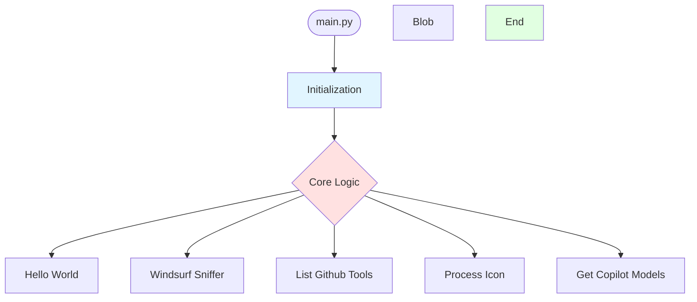

<!-- AUTO-UPDATED: 2026-02-17T23:59:19.744101 -->
<!-- Modified: .agent/docs/mcp_architecture_diagram.md, docs/vibe-usage.md, scripts/validate_mermaid.py -->

# Architecture Diagram - atlastrinity

> **Auto-generated by AtlasTrinity MCP devtools**  
> **Project Type:** python

## System Architecture

---

## Components

### Detected Components
- **Hello World**
- **Windsurf Sniffer**
- **List Github Tools**
- **Process Icon**
- **Get Copilot Models**
- **List Schemas**
- **List Missing Tools**
- **Copilot**
- **Factory**
- **Windsurf**

### Key Configuration Files
- `pyproject.toml`

---

**Last Updated:** Auto-generated  
**Project:** atlastrinity  
**Type:** python

### Vibe (AI agent) — Usage & Integration
The Vibe usage diagram and inventory are included in project exports.

