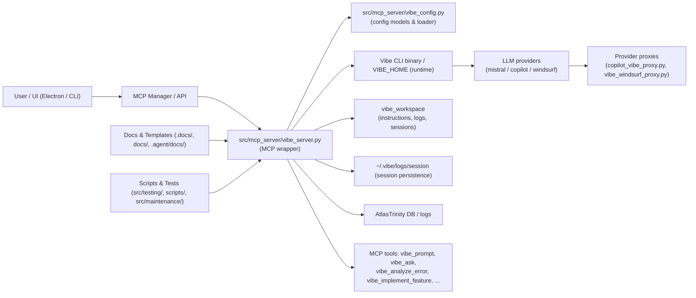

# Vibe — огляд використання в репозиторії

> Стисла візуалізація потоків використання `Vibe` в проекті та повна таблична інвентаризація файлів, які з ним взаємодіють.

## Графічна діаграма (Mermaid) ✅

---

## Короткий висновок (що я знайшов) 🎯
- `Vibe` в цьому репозиторії — повноцінно інтегрований як MCP-сервер (`vibe_server.py`) і як CLI-інструмент (`vibe` binary).
- Джерела використання: **код (runtime)**, **конфіг/шаблони**, **проксі провайдерів**, **тести / скрипти**, **документація**.
- Поширені сценарії: виконання prompt'ів, автотести в sandbox, code review, self-healing (vibe_analyze_error), модельні fallback'и та proxy/token-exchange (Copilot).

---

## Таблиця: всі файли/скрипти/доки, де використовується `vibe` 📋

| Файл | Тип | Де/коли використовується | Короткий опис / ключові функції |
|---|---|---|---|
| `src/mcp_server/vibe_server.py` | Код (runtime) | Сервер MCP — виклики під час runtime | Головна обгортка для `vibe` CLI; інструменти: `vibe_prompt`, `vibe_which`, `vibe_analyze_error`, `vibe_implement_feature`, session management, queueing, VIBE_HOME override, rate-limit fallback |
| `src/mcp_server/vibe_config.py` | Код / конфіг | Завантаження конфігів при старті | Pydantic-моделі (`VibeConfig`, `ProviderConfig`, `ModelConfig`), `to_cli_args()`, env підготовка, tool-permissions |
| `config/vibe_config.toml.template` | Конфіг (шаблон) | Редагується перед запуском | Шаблон providers/models/fallback_chain/defaults/agents |
| `src/providers/proxy/copilot_vibe_proxy.py` | Скрипт / proxy | Коли provider `copilot` вимагає proxy | OpenAI‑совісний proxy для Copilot (token exchange оптимізації) |
| `src/providers/proxy/vibe_windsurf_proxy.py` | Скрипт / proxy | Коли provider `windsurf` потребує proxy | OpenAI‑совісний proxy для Windsurf |
| `src/testing/test_vibe_full.py` | Тест | CI / локальні інтеграції | End-to-end тестування основних Vibe інструментів (prompt, implement, sandbox) |
| `src/testing/test_vibe_stream.py` | Тест | CI / локальні інтеграції | Тест стрімінгу/логування від Vibe |
| `src/testing/test_vibe_integration.py` | Тест | CI / інтеграція | Перевіряє аргументи, prompt-файли, базові інструменти |
| `src/testing/test_vibe_mcp_tools.py` | Тест | Unit / інтеграція | Тестування fallback/конфігураційних сценаріїв |
| `src/testing/test_vibe_thoughts.py` | Тест | Логіка форматування | Перевірка обробки структурованого виводу Vibe |
| `src/testing/test_vibe_deep.py` | Тест | Розширені сценарії | Глибші перевірки аналітики / auto-fix |
| `src/testing/test_vibe_optimized.py` | Тест | Perf / оптимізації | Перевірка оптимізованих викликів |
| `src/testing/test_vibe_streaming.sh` | Скрипт / тест | Локальні скрипти | Bash-скрипт для швидкої перевірки стріму |
| `src/testing/verify_vibe_models.py` | Utility / тест | Перевірка доступних моделей | Викликає `vibe_prompt` для кількох моделей через `mcp_manager` |
| `src/testing/verify_vibe_tools.py` | Тест | Інтеграційна перевірка | Гарантує наявність MCP-тулів Vibe |
| `src/testing/verify_vibe.py` | Скрипт | Локальна діагностика | Різні верифікаційні перевірки Vibe середовища |
| `src/testing/demo_vibe_visibility.py` | Demo | Демонстрація | Демонструє видимість Vibe через UI/логери |
| `src/testing/vibe_create_desktop_script.py` | Demo/script | Приклади використання | Приклад: Ask Vibe створити файл на Desktop |
| `src/maintenance/debug_vibe_subprocess.py` | Maintenance | Локальне відлагодження | PTY-based запуск для налагодження підпроцесу Vibe |
| `src/maintenance/update_vibe_server.py` | Maintenance | Патчі/міграції | Скрипт для застосування SQL/інших фіксів у `vibe_server` |
| `src/maintenance/fix_vibe_sql.py` | Maintenance | Виправлення SQL | Патч для `vibe_check_db` / UNION ALL проблем |
| `src/maintenance/restart_vibe_clean.sh` | Script | Операційні дії | Чистий перезапуск Vibe MCP (kill/cleanup) |
| `src/maintenance/monitor_vibe.sh` | Script | Моніторинг | Збір процесів, tail логів, workspace checks |
| `src/maintenance/live_vibe_monitor.sh` | Script | Live моніторинг | Live tail + emojis для швидкого аналізу |
| `scripts/verify_vibe_workspace.py` | Utility | Dev-time verification | Перевіряє шлях instruction файлів та argv перед викликом Vibe |
| `.agent/docs/vibe_diagram_github_integration.md` | Docs | Архітектурна інтеграція | Опис інтеграції Vibe з діаграмами та GitHub MCP (мермайд-діаграми) |
| `src/brain/mcp/data/protocols/vibe_docs.txt` | Docs / protocol | Reference для MCP | Короткий перелік MCP tools і usage notes |
| `.docs/vibe_cli_install.md` | Docs | Setup / onboarding | Інструкція встановлення Mistral Vibe CLI |
| `.docs/vibe_cli_install_configuration.md` | Docs | Setup | Конфігурація Vibe CLI (env, paths) |
| `.docs/vibe_cli_analysis.md` | Docs / audit | Архітектурний аналіз | Рекомендації щодо CLI vs pip та best-practices |
| `.docs/vibe_install_update_summary.md` | Docs | Release notes | Історія оновлень / notes |
| `.docs/docker_removal_and_vibe_update.md` | Docs / migration | Migration guide | Інструкції щодо видалення Docker для Vibe оновлень |
| `tests/test_vibe_server.py` | Unit tests | CI | Unit-тести для `vibe_config` та `vibe_server` допоміжних функцій |
| `tests/verify_vibe_smart.py` | Tests | E2E / smart flows | Перевіряє smart_plan / self-healing flows |
| `src/providers/proxy/vibe_windsurf_proxy.py` | Proxy | Runtime (windsurf provider) | OpenAI‑compat proxy для Windsurf провайдера |
| `src/providers/proxy/copilot_vibe_proxy.py` | Proxy | Runtime (copilot provider) | OpenAI‑compat proxy + token-exchange для Copilot |

---

## Примітки та рекомендації (швидко) 💡
- Token-exchange & proxy: `Copilot` вимагає proxy/token-exchange — реалізовано в `copilot_vibe_proxy.py` і у `_prepare_vibe_env()`.
- VIBE_HOME overrides: `vibe_server` готує тимчасові VIBE_HOME для перемикання моделей — це ключовий механізм fallback.
- Тести: `src/testing/*` активно покривають поведінку (`prompt`, `sandbox`, `streaming`). Рекомендується запускати їх при зміні `vibe_server`.

---

## Optional converter tools (SVG → PNG) 🖼️

- Purpose: CI and the `devtools_update_architecture_diagrams` export pipeline will try to convert SVG diagrams to PNG for documentation and UI assets.
- Recommended (dev): install `cairosvg` in your dev environment:
  - pip install -r requirements-dev.txt
- System fallbacks (if `cairosvg` is not available): `rsvg-convert` (librsvg) or ImageMagick's `convert` are also supported by the export script.
- Note: PNG conversion is best-effort — if conversion tools are not present CI will still include the SVG in exports.

Файл з діаграмою і таблицею збережено в `docs/vibe-usage.md` — відкрийте для швидкої навігації по репозиторію.
